
<strong><h2>Определения, формулировки, теоремы (без доказательства)</h2></strong>

---

## 1
**Дайте определение арифметического квадратного корня. Сформулируйте теоремы о свойствах арифметического квадратного корня (квадратный корень из произведения, дроби и степени)**

Арифметическим квадратным корнем из числа $a$ называется такое неотрицательное число, квадрат которого равен $a$

Теорема о квадратном корне из произведения - если $a\geq 0$ и $b\geq 0$, то $\sqrt{ ab }=\sqrt{ a }\cdot \sqrt{ b }$

Теорема о квадратном корне из дроби - $a\geq 0$ и $b > 0$, то $\sqrt{ \frac{a}{b} }=\frac{\sqrt{ a }}{\sqrt{ b }}$

Теорема о квадратном корне из степени - $\sqrt{ a^2 }=|a|$

---

## 2
**Сформулируйте определение квадратного уравнения, полного и неполного квадратного уравнения, приведенного и неприведенного квадратного уравнения. Запишите формулы корней квадратного уравнения в общем виде, корней квадратного уравнения с чётным вторым коэффициентом**

*(В примерах везде рассматривается уравнение $ax^{2}+ bx + c = 0$, если не указано иное. Верно для номеров, где упоминаются квадратные уравнения)*

Квадратное уравнение - уравнение вида $ax^{2}+ bx + c = 0$, где a, b, c - числа, причем $a\neq0$, иначе оно будет линейным

Квадратное уравнение называется полным, если все коэффициенты отличны от нуля, т.е. $a\neq0,b\neq 0,c\neq 0$

Квадратное уравнение называется неполным, если хотя бы один из коэффициентов b или c равен нулю

Квадратное уравнение называется приведённым, если коэффициент при $x^2$ равен 1 ($a=1$)

Квадратное уравнение называется неприведённым, если коэффициент при $x^2$ не равен 1 ($a\neq 1$)

Формулы:

В общем виде:
- $D=b^2-4ac$
- $x_{1,2}=\cfrac{-b\pm \sqrt{ D }}{2a}$

Если $b=2k$ (b - четный):
- $D=k^2-ac$
- $x_{1,2}=\cfrac{-k\pm \sqrt{ D }}{a}$

---

## 3
**Сформулируйте теорему Виета. Сформулируйте следствия теоремы Виета (А+В+С=0, А+С=В).**

Теорема Виета - если числа $x_{1}$ и $x_{2}$ являются корнями квадратного уравнения, то 

$$x_{1}+x_{2}=-\frac{b}{a}$$

$$x_{1}x_{2}=\frac{c}{a}$$

Следствия:
1) Если $a+b+c=0$, то один из корней равен 1
2) Если $a+c=b$, то один из корней равен -1

---

## 4
**Сформулируйте определение квадратного трехчлена, дайте определение корня квадратного трехчлена. Сформулируйте и докажите теорему о разложении на множители квадратного трехчлена, имеющего корни**

*(В примерах везде рассматривается квадратный трехчлен $ax^{2}+ bx + c$, если не указано иное. Верно для номеров, где упоминаются квадратные трехчлены)*

Квадратным трёхчленом называется выражение вида $ax^{2}+ bx + c$, где a, b, c - числа, причем $a\neq0$

Корнем квадратного трёхчлена называется такое значение переменной x, при котором значение трёхчлена равно нулю

Теорема - если квадратный трехчлен имеет различные корни $x_{1}$ и $x_{2}$, то 

$$ax^2+bx+c=a(x-x_{1})(x-x_{2})$$

**Док-во:**

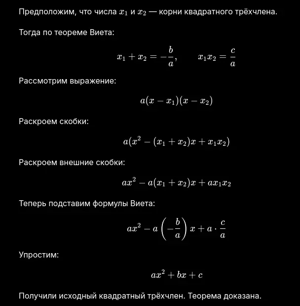

---

## 5
**Дайте определение степени с целым отрицательным показателем. Сформулируйте свойства степени с целым показателем. Дайте определение стандартного вида числа**

Степенью числа a с целым отрицательным показателем -n называется число, обратное степени с натуральным показателем n, где $a\neq0, n∈N$:

$$a^{-n}=\frac{1}{a^n}$$

Свойства:
- При умножении степеней с одинаковым основанием показатели складываются: $a^m\cdot a^n=a^{m+n}$
- При делении степеней с одинаковым основанием показатели вычитаются: $\frac{a^m}{a^n}=a^{m-n}$
- $(a^m)^n=a^{mn}$
- $(ab)^n=a^nb^n$
- $\left( \cfrac{a}{b} \right)^n=\cfrac{a^n}{b^n}$
- $a^0=1$

Число записано в стандартном виде, если оно представлено в виде $a\cdot 10^n$, где $1\leq|a|<10, n∈Z$

---

## 6
**Дайте определение функции, области определения и области значений функции, нулей функции, промежутков знакопостоянства**

$y=f(x)$
Независимая переменная x - аргумент

Функцией называется зависимость, при которой каждому значению независимой переменной x соответствует единственное значение переменной y

Областью определения функции называется множество всех значений аргумента x, при которых функция имеет смысл. Обозначается $D(y)$

Областью значений функции называется множество всех значений, которые принимает функция. Обозначается $E(y)$

Нулями функции называются значения аргумента, при которых значение функции равно нулю

Промежутками знакопостоянства функции называются промежутки, на которых функция сохраняет один и тот же знак (то есть больше нуля или меньше нуля)

---

## 7
**Функция $y=\sqrt{ x }$ и её график. Укажите свойства функции: область определения, область значений функции, точки пересечения с осями, промежутки знакопостоянства**

Функция квадратного корня

График функции представляет собой ветвь параболы, расположенную в первой координатной четверти

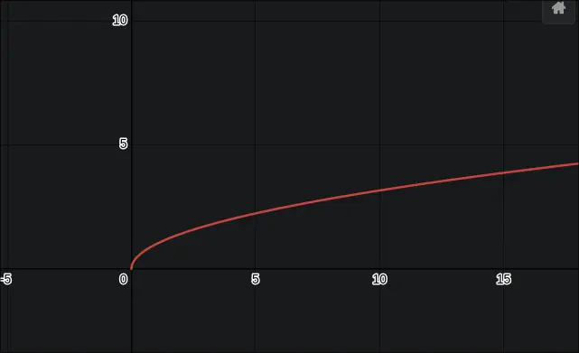

Свойства:
- $D(f)=[0;+∞)$
- $E(f)=[0;+∞)$
- Точки пересечения с осями координат:
	- С осью $Ox$ - $(0;0)$
	- С осью $Oy$ - $(0;0)$
- Промежутки знакопостоянства:
	- $y>0$ при $x∈(0;+∞)$
	- y не может быть меньше нуля
- Ноль функции - $x=0$

---
---
---

<strong><h2>Основные вопросы</h2></strong>

---

## 8
**Дайте определение сравнения двух чисел. Сформулируйте свойства числовых неравенств. Докажите одно из свойств числовых неравенств**

Число a больше числа b, если a−b > 0
Число a меньше числа b, если a−b < 0

Св-ва:
- Если $a>b$, то $b<a$
- Если $a>b$ и $b>c$, то $a>c$
- Если $a>b$, то $a+c>b+c$
- Если $a>b,c>0$ то $ac>bc$
- Если $a>b,c<0$, то $ac<bc$

Д-ть: Если $a>b$, то $a+c>b+c$

Тк a>b, то a-b>0
Р-им разность (a+c)-(b+c)=a-b
Но a-b>0
Тогда a+c-(b+c)>0
a+c>b+c
*ЧТД*

---

## 9
**Дайте определение степени с целым отрицательным показателем. Сформулируйте свойства степени с целым показателем. Дайте определение стандартного вида числа.**

[Ответ в номере 5](#5)

---

## 10
**Сдвиг графиков функций вдоль осей координат. Привести примеры**

*В номерах стандартная/используемая/начальная функция выглядит как $y = f(x)$, если не указано иное*

Пусть изначальная функция $y = f(x)$, тогда:
- $y = f(x-a)$, то сдвиг вправо на a
- $y = f(x+a)$, то сдвиг влево на a
- $y = f(x)+a$, то сдвиг вверх на a
- $y = f(x)-a$, то сдвиг вниз на a

Примеры:
- $y=x^2+3$ - парабола сдвинута вверх на 3

- $y=(x-2)^2$ - парабола сдвинута вправо на 2
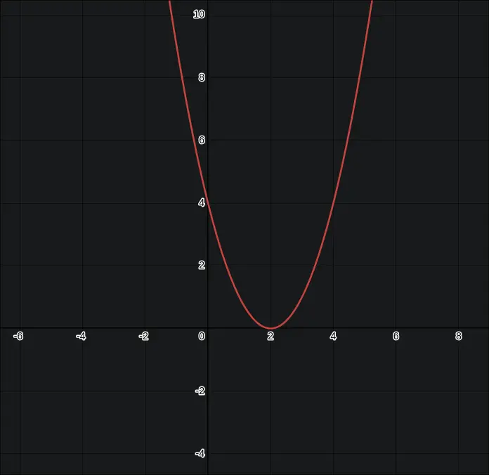

---

## 11
**Растяжение и сжатие графиков функций вдоль оси ординат. Привести примеры**

[Начальная функция](#10)

Р-им $y=kf(x)$:
- Если k > 1, график сжимается к оси Oy
- Если 0 < k < 1, график растягивается от оси Oy

Примеры:

- $y=2x^2$
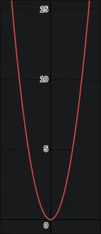

- $y=\frac{1}{2}x^2$
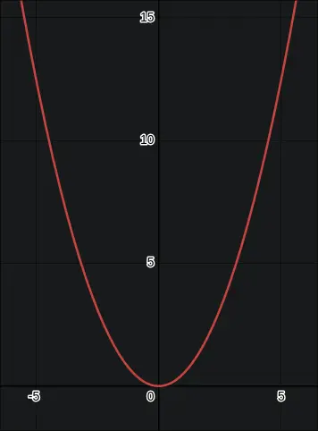

---

## 12
**Растяжение и сжатие графиков функций вдоль оси абсцисс. Привести примеры**

[Начальная функция](#10)

Р-им $y=f(kx)$:
- Если k > 1, график растягивается от оси Ox
- Если 0 < k < 1, график сжимается к оси Ox

Примеры:

- $y=(2x)^2$
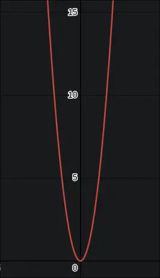

- $y=(\frac{1}{2}x)^2$
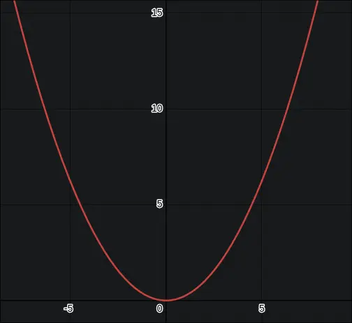

---

## 13
**Графики функций $y=∣f(x)∣$ и $y=f(∣x∣)$. Привести примеры**

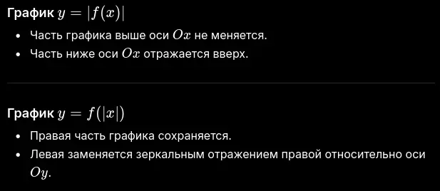

$y=|x^2-4|$
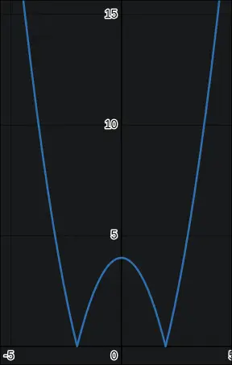

$y=\sqrt{ |x| }$
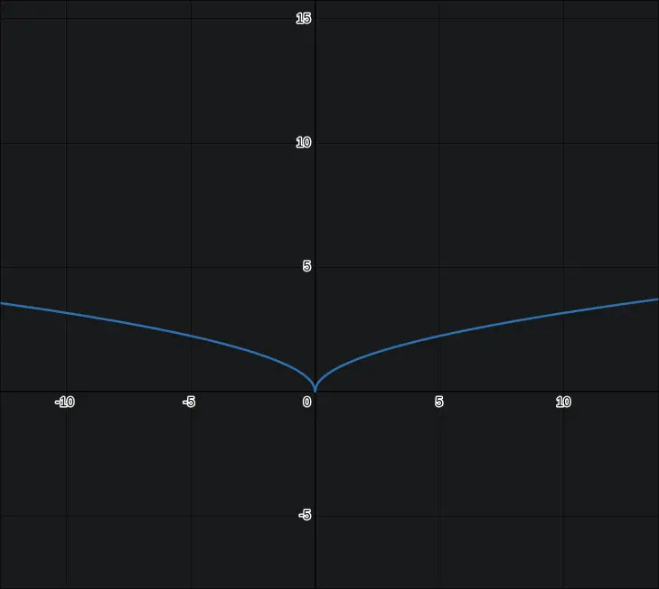

---

## 14
**Графики функций $y=x^{−1}, y=x^{-2}$. Укажите свойства функций: область определения, область значений функции, асимптоты, промежутки знакопостоянства, симметрия графика**

$$y=x^{-1}$$

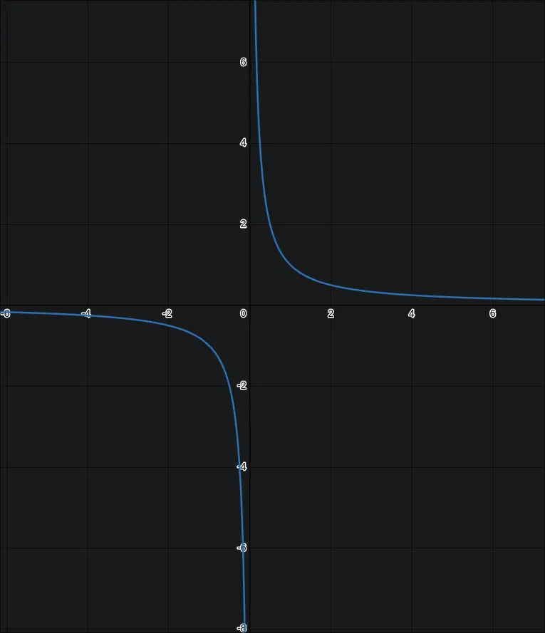

$D(y)=E(y)=(-\infty; 0)\cup(0;+\infty)$

Асимптоты: x=0, y=0

При x > 0: y > 0
При x < 0: y < 0

Симметрия: нечетная функция(симметрия относительно начала координат)

--
$$y=x^{-2}$$

$D(y)=(-\infty; 0)\cup(0;+\infty)$
$E(y)=(0;+\infty)$

Асимптоты: x=0, y=0

$y>0$ всегда

Симметрия: четная функция(симметрия относительно оси ординат)

---

## 15
**Дайте определение обратной пропорциональности. График функции обратной пропорциональности. Укажите свойства функции: область определения, область значений функции, асимптоты, промежутки знакопостоянства**

Обратная пропорциональность - функция вида $y=\cfrac{k}{x}$
График - гипербола

$D(y)=E(y)=(-\infty; 0)\cup(0;+\infty)$
Асимптоты: x=0, y=0

при k > 0:
- y > 0 при x > 0
- y < 0 при x < 0;
при k < 0:
- y > 0 при x < 0
- y < 0 при x > 0.

---

## 16
**Дайте определение дробно-линейной функции. Постройте график функции $y=\frac{x+4}{x+5}​$. Укажите свойства функции: область определения, область значений функции, асимптоты, точки пересечения с осями, промежутки знакопостоянства**

Дробно-линейная функция - функция вида $y=\cfrac{ax+b}{cx+d}$, причем $c\neq 0$

$y=\cfrac{x+4}{x+5}​$

$y=1-\cfrac{1}{x+5}$

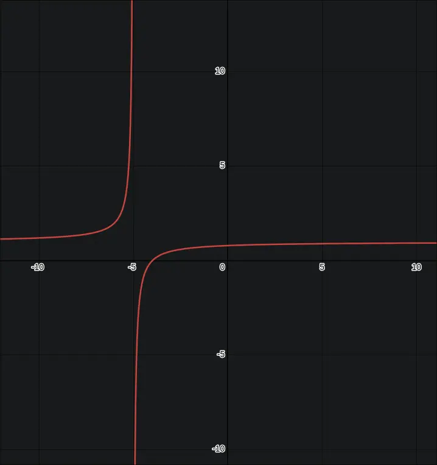

$D(y)=(-\infty; -5)\cup(-5;+\infty)$
$E(y)=(-\infty; 1)\cup(1;+\infty)$

Асимптоты: x = -5, y = 1

Пересечение с осью $Ox$ в точке $(−4;0)$
Пересечение с осью $Oy$ в точке $\left( 0; \cfrac{4}{5} \right)$

y > 0 при $x\in(-\infty; -5)\cup(-4;+\infty)$
y < 0 при $x\in(-5; -4)$

---

## 17
**Функции $y=ax^2, y=ax^2+n, y=a(x−m)^2$. Их свойства. Привести примеры**

$y=ax^2$
парабола с вершиной в начале координат
при a>0 ветви вверх;функция убывает на (-∞; 0) и возрастает на (0; +∞), наименьшее значение y = 0 при x = 0, наибольшего значения нет. Область значений: E(y) = [0; +∞)
при a<0 ветви параболы направлены вниз, функция возрастает на (-∞; 0) и убывает на (0; +∞), наибольшее значение y = 0 при x = 0, наименьшего значения нет. Область значений: E(y) = (-∞; 0]

$y=ax^2+n$
сдвиг параболы вверх или вниз

$y=a(x−m)^2$
сдвиг параболы вправо или влево

Примеры:
- $y=2x^2$
- $y=x^2+3$
- $y=(x-4)^2$

---

## 18
**График и свойства квадратичной функции (область определения, область значений функции, промежутки знакопостоянства, симметрия графика)**

$y=f(x)=ax^2+bx+c,a\neq0$

График - парабола

D(y) = R
E(y) > 0 при a > 0; E(y) < 0 при a < 0

Ось симметрии: $x=-\cfrac{b}{2a}$

Функция больше нуля везде кроме x=0 при a>0
Функция меньше нуля везде кроме x=0 при a<0

---

## 19
**Натуральные и целые числа. Делимость чисел.  Сформулируйте признаки делимости чисел на 2, 3, 5, 4, 25, 9 и 11**

Натуральные числа - их мн-во обозначается буквой N. Являются положительными целыми числами

Целые числа - их мн-во обозначается буквой Z

Признаки делимости:
- на 2 - последняя цифра чётная
- на 3 - сумма цифр делится на 3
- на 4 - если число, образованное его последними двумя цифрами, делится на 4
- на 5 - оканчивается на 0 или 5
- на 9 - сумма цифр делится на 9
- на 10 - оканчивается на 0
- на 11 - если разность между суммой цифр, стоящих на нечётных позициях, и суммой цифр, стоящих на чётных позициях, делится на 11
- на 25 - если его последние две цифры образуют число, которое делится на 25

---

## 20
**Сформулируйте свойства делимости. Делимость суммы и произведения**

Свойства:
- Если $a\vdots b,b\vdots c$, то $a\vdots c$
- Если $a\vdots c,b\vdots c$, то $a+b\vdots c$
- Если $a\vdots c$, то $ab\vdots c$

Делимость суммы - если каждое слагаемое делится на число c, то и сумма делится на c

Делимость произведения - если один из множителей делится на c, то и всё произведение делится на c

---

## 21
**Дайте определение простых и составных чисел. Приведите примеры**

Простое число - нат. число, имеющее только два делителя - 1 и оно само
Примеры: 1, 5, 3, 7, 11

Составное число - нат. число, имеющее более двух делителей
Примеры: 2, 4, 14, 25

---

## 22
**Сформулируйте теорему о количестве делителей натурального числа**

Если $n\in N$ и 

$$n={P_{1}}^{a_{1}}\cdot{P_{2}}^{a_{2}}\dots {P_{k}}^{a_{k}}$$

то количество его множителей равно

$$(a_{1}+1)(a_{2}+1)(a_{3}+1)\dots(a_{k}+1)$$

---

## 23
**Бесконечность простых чисел. Каноническое разложение натурального числа в произведение простых множителей**

Теорема - простых чисел бесконечно много

Каноническое разложение - любое натуральное число больше 1 можно единственным образом представить в виде произведения простых множителей:

$$n={P_{1}}^{a_{1}}\cdot{P_{2}}^{a_{2}}\dots {P_{k}}^{a_{k}}$$

---

## 24
**Сформулируйте теорему о делении с остатком**

Для любых целых чисел a и b, где b>0, существуют единственные числа q и r, такие что:

$$a=bq+r, 0\leq r<b$$

---

## 25
**Дайте определение НОД и НОК чисел. Алгоритм Евклида вычисления НОД двух чисел**

Наибольшим общим делителем чисел называется наибольшее число, на которое делятся оба числа

Наименьшим общим кратным называется наименьшее натуральное число, которое делится на оба числа

Алгоритм Евклида - чтобы найти НОД двух чисел:
1. Большее число делят на меньшее
2. Затем меньшее число делят на остаток
3. Процесс продолжают, пока остаток не станет нулём
4. Последний ненулевой остаток — НОД

Пример:
НОД(48,18)

$48 = 18\cdot 2 + 12$
$18=12\cdot 1+6$
$12=6\cdot 2+0$

НОД(48,18) = 6

---
---
---
