
<strong><h2>Часть первая. Без доказательств</h2></strong>

---
	
1) Дайте определение параллелограмма(пм). Сформулируйте св-ва пма. Сформулируйте признаки пма.
	
	Пм - четырехугольник у которого стороны попарно параллельны
	
	Св-ва:
	- Противоположные стороны равны
	- Противоположные углы равны
	- Диагонали точкой пересечения делятся пополам
	
	Признаки:
	- Если в четырехугольнике две стороны равны и параллельны, то это пм
	- Если в четырехугольнике противоположные стороны попарно равны, то это пм
	- Если в четырехугольнике диагонали пересекаются и точкой пересечения делятся пополам, то это пм
	
---
	
2) Теорема Фалеса
	
	Если на одной из двух прямых последовательно отложить несколько равных отрезков и через их концы провести паралл. прямые, пересекающие вторую прямую, то они отекут на второй прямой равные между собой отрезки
	
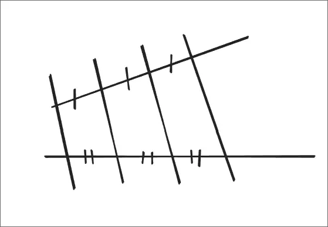
	
---
	
3) Дайте определение треугольника и средней линии треугольника. Сформулируйте теорему о средней линии треугольника
	
	Треугольник - многоугольник с тремя вершинами. 
	
	Средняя линия треугольника - отрезок, соединяющий середины двух сторон треугольника.
	
	Теорема - cредняя линия треугольника параллельна одной из его сторон и равна половине этой стороны
	
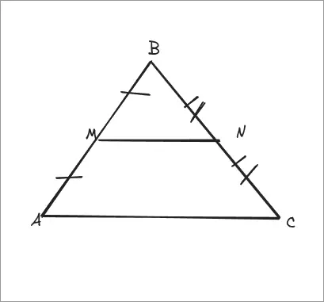
	
MN - средняя линия ΔABC
	
$MN = \dfrac{AC}{2}$
	
---
	
4) Дайте определение трапеции, пруг(прямоугольной) трапеции, рб(равнобедренной) трапеции. Сформулируйте св-ва и признаки рб трапеции.
	
	Трапеция - четырехугольник, у которого две стороны параллельны, а две другие стороны не параллельны. Парал. стороны - основания, две другие - боковые стороны.
	
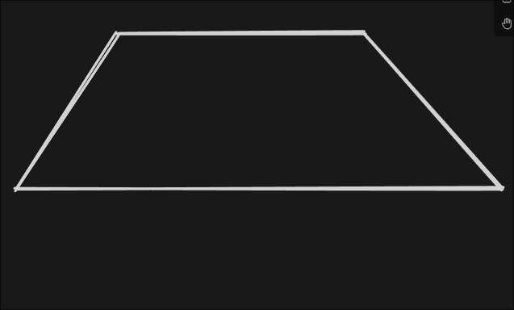
	
	
Трапеция прямоугольная если у нее один угол прямой.
	
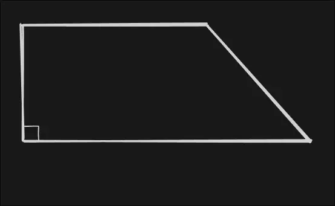
	
	
Трапеция рб если ее боковые стороны равны.
	
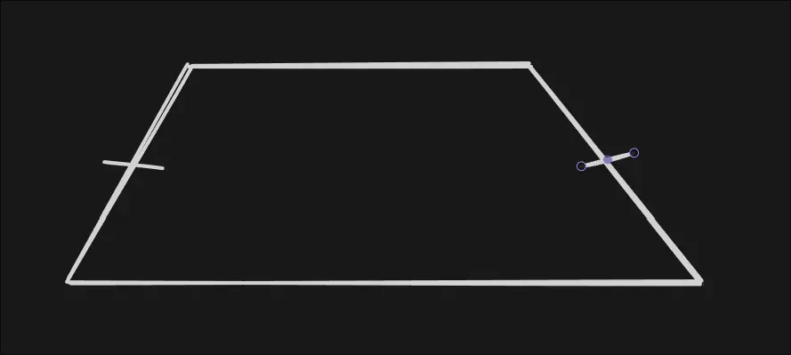
	
	
Св-ва рб трапеции:
- Углы при основании равны
- Диагонали равны
	
Признаки рб трапеции:
- Если углы при основании трапеции равны, то она рб
- Если диагонали трапеции равны, то она рб
	
---
	
5) Дайте определение трапеции, средней линии трапеции. Сформулируйте теорему о средней линии трапеции.
	
	Трапеция - четырехугольник, у которого две стороны параллельны, а две другие стороны не параллельны. Парал. стороны - основания, две другие - боковые стороны.
	
	Средняя линия трапеции - отрезок, соединяющий середины боковых сторон трапеции.
	
	Теорема - cредняя линия трапеции параллельна основаниям трапеции и равна их полусумме
	
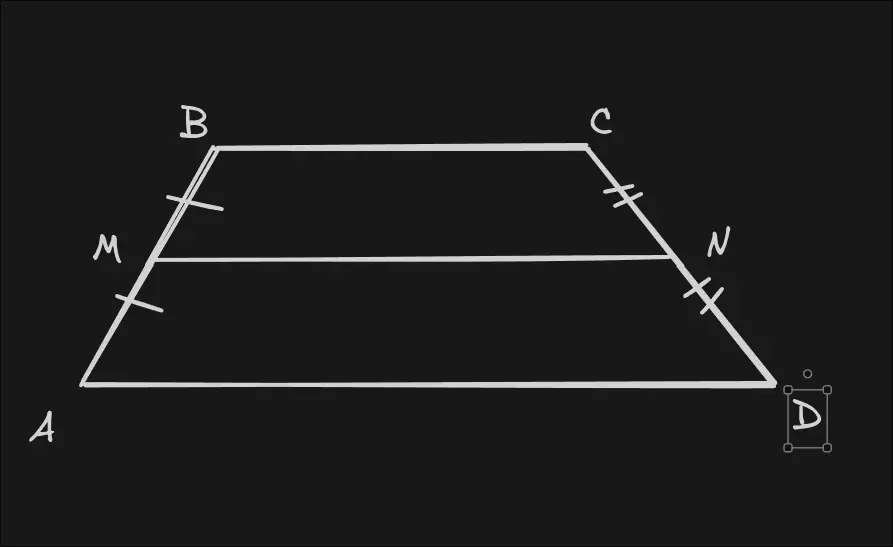
	
	
MN - средняя линия трапеции ABCD
	
$MN || AD$
	
$MN = \dfrac{a+b}{2}$
	
---
	
6) Сформулируйте теорему Вариньона
	
	Середины сторон выпуклого четырехугольника являются вершинами параллелограмма
	
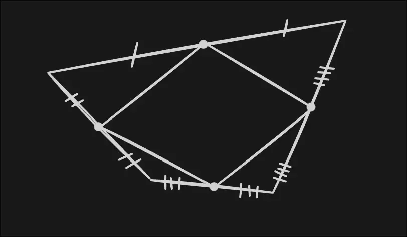
	
---
	
7) Дайте определение прямоугольника. Сформулируйте особое св-во прямоугольника. Сформулируйте признак прямоугольника.
	
	Прямоугольник - пм, у которого все углы прямые.
	
	Особое св-во - диагонали прямоугольника равны.
	
	Признак - если в пм-е диагонали равны, то это прямоугольник
	
---
	
8) Дайте определение квадрата, ромба. Сформулируйте особое св-во ромба.
	
	Квадрат - прямоугольник, у которого все стороны равны.
	
	Ромб - пм, у которого все стороны равны.
	
	Особое св-во ромба - диагонали ромба взаимно перпендикулярны и делят его углы пополам
	
---
	
9) Сформулируйте св-ва площадей многоугольников. Сформулируйте теорему о площади прямоугольника.
	
	Св-ва площадей многоугольников:
	- Равные многоугольники имеют равные площади
	- Если многоугольник составлен из нескольких многоугольников, то его площади равна сумме площадей этих многоугольников.
	- Площадь квадрата равна квадрату его стороны
	
	Теорема о площади прямоугольника - площадь прямоугольника равна произведению его смежных сторон
	
---
	
10) Сформулируйте св-ва площадей многоугольников. Сформулируйте теоремы о площади пм-а и площади треугольника.
	
	Св-ва площадей многоугольников:
	- Равные многоугольники имеют равные площади
	- Если многоугольник составлен из нескольких многоугольников, то его площади равна сумме площадей этих многоугольников.
	- Площадь квадрата равна квадрату его стороны
	
	Теорема о площади пм-а - площадь пм-а равна произведению его основания на высоту
	
	Теорема о площади треугольника - площадь треугольника равна половине произведения его основания на высоту
	
---
	
11) Сформулируйте следствия теоремы о площади треугольника (площади рст(равностороннего) и пруг(прямоугольного) треугольников)
	
	Следствие 1 - площадь пруг треугольника равна половине произведения его катетов
	
	Следствие 2 - если высоты двух треугольников равны, то их площади относятся как основания
	
---
	
12) Сформулируйте теорему об отношении площадей двух треугольников имеющих по:
	- Равному углу
	- Равной стороне
	- Равной высоте
	
	Теорема - если угол одного треугольника равен углу другого треугольника, то площади этих треугольников относятся как произведения сторон, заключающих эти углы.
	
	Теорема - если высоты двух треугольников равны, то их площади относятся как основания
	
	Теорема - если основания двух треугольников равны, то их площади относятся как высоты, проведённые к этим основаниям.
	
---
	
13) Сформулируйте св-ва площадей многоугольников. Сформулируйте теорему о вычислении площади трапеции.
	
	Св-ва площадей многоугольников:
	- Равные многоугольники имеют равные площади
	- Если многоугольник составлен из нескольких многоугольников, то его площади равна сумме площадей этих многоугольников.
	- Площадь квадрата равна квадрату его стороны
	
	Теорема - площадь трапеции равна произведению полусуммы её оснований на высоту (или ее средней линии на высоту)
	
---
	
14) Дайте определение окружности, касательной к окружности, хорды, секущей к окружности, центрального и вписанного углов
	
	Окружность - геом. фигура, сост. из всех точек плоскости, расположенных на заданном расстоянии от данной точки. Данная точка - центр окружности, расстояние - ее радиус (иначе определение звучит так: окружность - геометрическое место точек, равноудаленных от центра)
	
	Касательная к окружности - прямая,имеющая с окружностью только одну общую точку
	
	Секущая к окружности - прямая, имеющая с окружностью две общие точки
	
	Хорда - отрезок, соединяющий любые две точки окружности и при этом не проходящие через ее центр
	
	Центральный угол - угол с вершиной в центре окружности
	
	Вписанный угол - угол, вершина которого лежит на окружности, и стороны которого пересекают окружность
	
---
	
15) Дайте определение вписанного и описанного многоугольника. Определите положение центра вписанной и описанной окружностей.
	
	Если все стороны многоугольника касаются окружности, то окружность называют вписанной в многоугольник, а многоугольник - описанным около этой окружности
	
	Если все вершины многоугольника лежат на окружности, то окружность называется описанной около многоугольника, а многоугольник вписанным в эту окружность
	
	Центр описанной окружности находится на пересечении серединных перпендикуляров к сторонам многоугольника
	
	Центр вписанной окружности находится на пересечении биссектрис углов многоугольника
	
---
	
16) Дайте определение пропорциональных отрезков. Дайте определение подобных треугольников. 
	
	Говорят, что отрезки a и b пропорциональны отрезкам c и d, если $\frac{a}{c}=\frac{b}{d}$
	
	Два треугольника называют подобными, если их углы соответственно равны и стороны одного треугольника пропорциональны сходственным сторонам другого треугольника
	
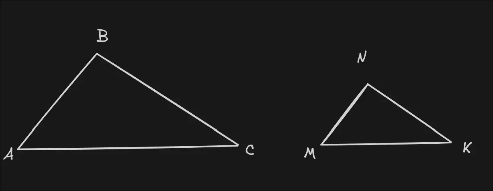
	
	
ΔABC ~ ΔMNK, если:
	
$∠A=∠M, ∠B=∠N, ∠C=∠K$
	
$\frac{AB}{MN}=\frac{BC}{NK}=\frac{AC}{MK}=k$
	
Где k - коэффициент подобия 
	
---
	
17) Сформулируйте признак подобия треугольников по 2-м углам
	
	Если два угла одного треугольника соответственно равны двум углам другого треугольника, то такие треугольники подобны
	
---
	
18) Сформулируйте признак подобия треугольников по 2-м пропорциональным сторонам и углу между ними
	
	Если две стороны одного треугольника пропорционально равны двум сторонам другого треугольника и углы, заключенные между этими сторонами, равны, то такие треугольники подобны
	
---
	
19) Сформулируйте признак подобия треугольников по трем пропорциональным сторонам
	
	Если три стороны одного треугольника пропорциональны трем сторонам другого, то такие треугольники подобны
	
---
	
20) Дайте определение медианы треугольника. Сформулируйте св-ва медиан треугольника
	
	Медиана треугольника - отрезок, соединяющий вершину треугольника с серединой противоположной стороны
	
	Св-во:  медианы треугольника пересекаются в одной точке и делятся ею в отношении 2 : 1 считая от вершины
	
---
	
21) Дайте определение высоты треугольника. Сформулируйте св-во высот треугольника
	
	Высота треугольника - перпендикуляр, проведенный из вершины треугольника к прямой, содержащей противоположную сторону
	
	Высоты треугольника или их продолжения пересекаются в одной точке
---
	
22) Определение среднего геометрического двух отрезков. Сформулируйте теоремы о пропорциональных отрезках в прямоугольном треугольнике
	
	Среднее геометрическое (пропорциональное) двух отрезков - отрезок, длина которого равна квадратному корню произведения длин двух данных отрезков
	
	Пусть даны два отрезка длиной $a$ и $b$. Тогда отрезок длиной $c$ называется их средним геометрическим, если выполняется пропорция:
	
	$\frac{a}{c}=\frac{c}{b}$
	
	Отсюда следует основная формула:
	
	$c=\sqrt{ a\cdot b }$
	
	c - среднее геометрическое отрезков $a$ и $b$
	
	Теоремы:
	- Высота, опущенная из вершины прямого угла на гипотенузу, есть среднее геометрическое между отрезками, на которые она делит гипотенузу
	- Катет прямоугольного треугольника есть среднее геометрическое между гипотенузой и проекцией этого катета на гипотенузу
	- Три треугольника - исходный прямоугольный и два меньших, образованных высотой, - подобны между собой
	
---
	
23) Дайте определение пропорциональных отрезков. Сформулируйте обобщенную теорему Фалеса (теорема о пропорциональных отрезках)
	
	Говорят, что отрезки a и b пропорциональны отрезкам c и d, если $\frac{a}{c}=\frac{b}{d}$
	
	Теорема - параллельные прямые, пересекающие стороны угла отсекают на сторонах угла пропорциональные отрезки.
	
---
	
24) Сформулируйте и проиллюстрируйте теоремы Чевы, Менелая
	
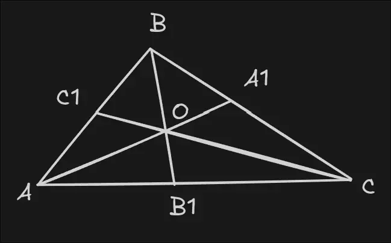
	
Теорема Чевы - пусть на сторонах $AB, BC, AC$  $ΔABC$ отмечены точки $C_{1}, A_{1}, B_{1}$ соответственно. Тогда прямые $AA_{1}, BB_{1}, CC_{1}$ будут пересекаться в одной точке тогда и только тогда, когда выполняется равенство
	
$\frac{AB_{1}}{B_{1}C}\cdot\frac{CA_{1}}{A_{1}B}\cdot\frac{BC_{1}}{C_{1}A}=1$
	
	
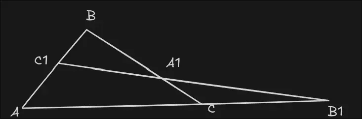
	
Теорема Менелая - точки $A_{1}, B_{1}, C_{1}$ лежат на одной прямой, тогда и только тогда, когда выполняется равенство
	
$\frac{AC_1}{C_1B} \cdot \frac{BA_1}{A_1C} \cdot \frac{CB_1}{B_1A} = 1$
	
---
	
25) Дайте определение биссектрисы треугольника. Сформулируйте теорему о биссектрисе внутреннего угла треугольника
	
	Биссектриса треугольника - отрезок биссектрисы угла треугольника, соединяющий вершину треугольника с точкой противоположной стороны
	
	Теорема - биссектриса треугольника делит его сторону на отрезки, пропорциональные прилежащим к ним сторонам
	
---
	
26) Какие точки называются замечательными точками треугольника?
	
	Центроид (Точка пересечения медиан) - G
	- Делит каждую медиану в отношении 2:1, считая от вершины. 
	
	
	Инцентр (Точка пересечения биссектрис) - I
	- Это центр вписанной окружности. Она всегда находится внутри треугольника и равноудалена от всех сторон.
	
	
	Ортоцентр (Точка пересечения высот) - H
	
	Расположение зависит от типа треугольника:
	- В остроугольном - внутри.
	- В прямоугольном - совпадает с вершиной прямого угла.
	- В тупоугольном - снаружи треугольника.
	
	
	Циркумцентр (Точка пересечения серединных перпендикуляров) — O
	
	Точка пересечения перпендикуляров, восстановленных из середин всех трёх сторон треугольника.
	
	Это центр описанной окружности. Равноудалён от всех вершин.
	
	
	
---
---
---

<strong><h2>Часть вторая. Основные вопросы</h2></strong>

---
	
27) Сформулируйте св-ва площадей многоугольников. Сформулируйте и докажите теорему о площади прямоугольника.

Св-ва площадей многоугольников:
- Равные многоугольники имеют равные площади
- Если многоугольник составлен из нескольких многоугольников, то его площади равна сумме площадей этих многоугольников.
- Площадь квадрата равна квадрату его стороны

**Теорема о площади прямоугольника - площадь прямоугольника равна произведению его смежных сторон**

**Док-во:**

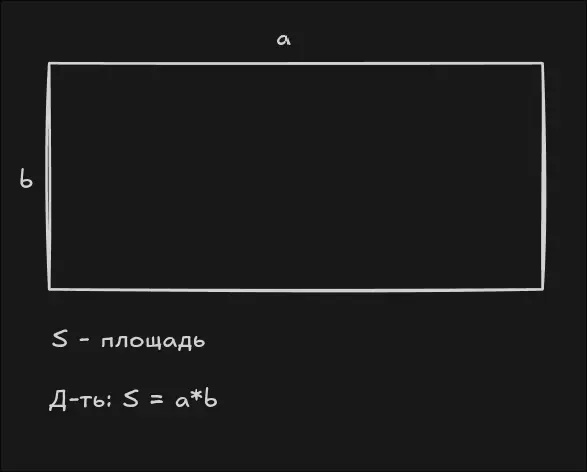

Достроим прямоугольник до квадрата со стороной a+b.

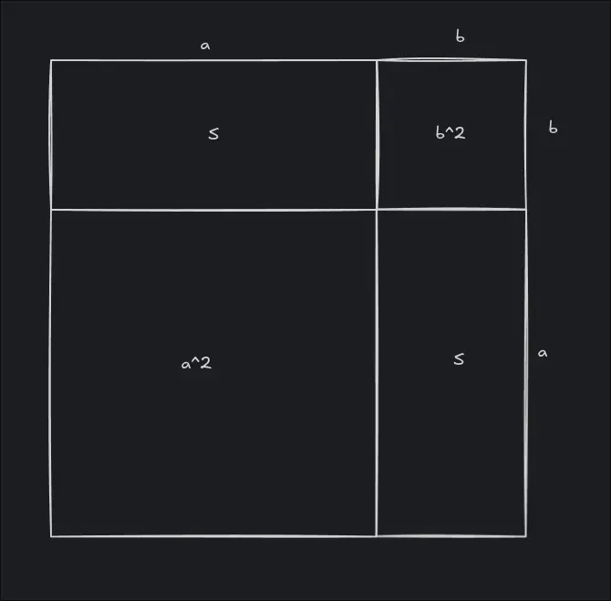

По 3-му св-ву площадей многоугольников площадь этого квадрата равна $(a+b)^2$

Этот квадрат составлен из двух данных прямоугольников и двух квадратов площадями $a^2$ и $b^2$

По 2-му св-ву: $(a+b)^{2}=2S+a^2+b^2$, т.е. $a^2+2ab+b^2=2S+a^2+b^2$

После сокращения получаем $S=ab$

*ЧТД*

---

28) Сформулируйте теоремы о площади пм-а и площади треугольника.

Теорема о площади пм-а (1) - площадь пм-а равна произведению его основания на высоту

Теорема о площади треугольника (2) - площадь треугольника равна половине произведения его основания на высоту

**Док-во теоремы (1):**

Пм ABCD, площадь - S
AD - нижнее основание
BH, CK ⊥ (AD)
H, K ∈ (AD)

Д-ть:
$S_{ABCD} = AD\cdot BH$

Р-им возможные случаи расположения H на прямой AD:

H = A => пм - прямоугольник, утверждение верно

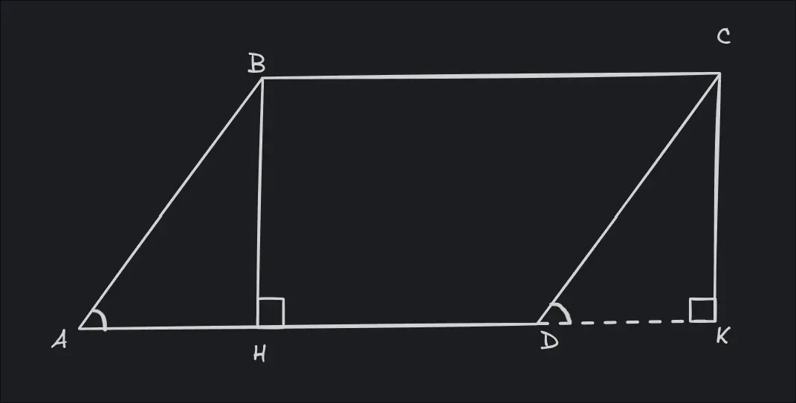

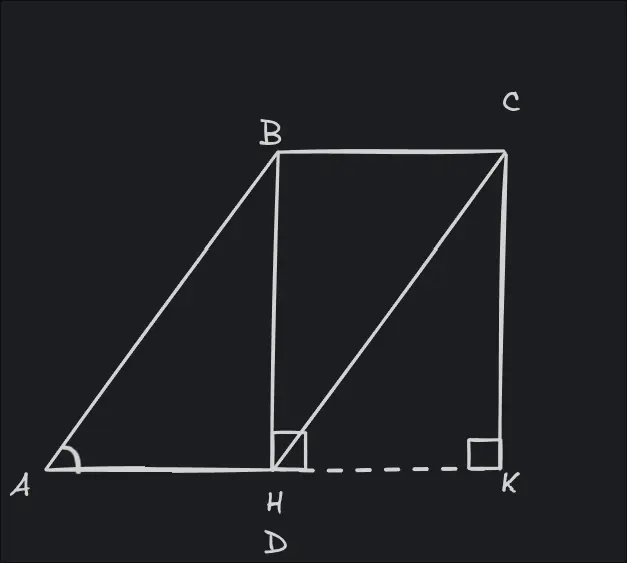

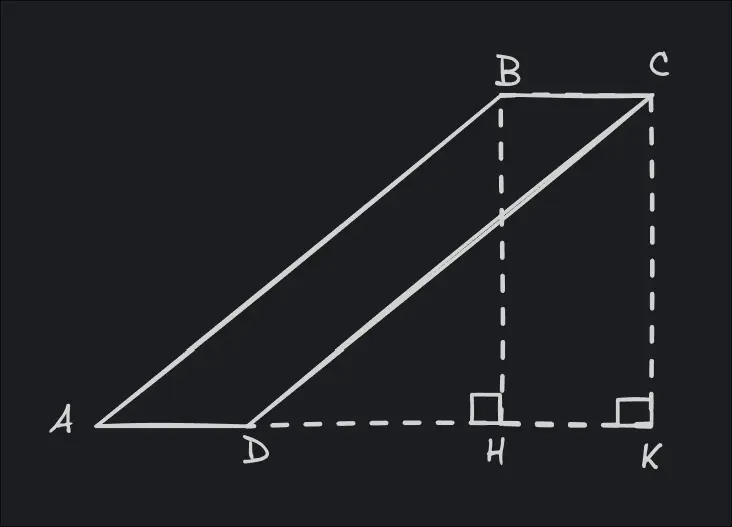

Р-им первый случай:

1. Пм ABCD состоит из пруг ΔABH и трапеции HBCD => $S_{ABCD}=S_{ΔABH}+S_{HBCD}$
2. Прямоугольник BHKC состоит из пруг ΔCDK и трапеции HBCD => $S_{BHKC}=S_{ΔCDK}+S_{HBCD}$

3. ΔABH и ΔDCK, ∠AHB = ∠K = 90°:
	- ∠A = ∠CDK (нл углы при AB||CD и сек AD)
	- AB = CD - противопол. стороны пма
	
	=> ΔABH и ΔDCK по острому углу и гипотенузе

4. Из п.1 и п.2 => $S_{ABCD}=S_{BHKC}$
5. $S_{BHCK}=BC\cdot BH$, а т.к. BC = AD, то $S_{BHCK}=AD\cdot BH$
6. Из п.4 и п.5 => $S_{ABCD}=AD\cdot BH$
*ЧТД*

**Док-во теоремы (2):**

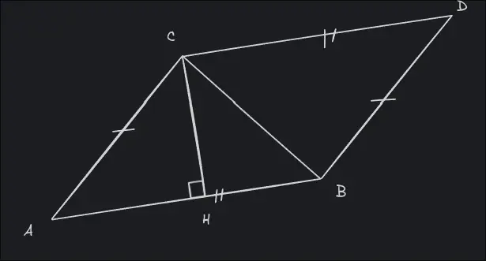

Д-ть: $S_{ΔABC}=\frac{AB\cdot CH}{2}$

Достроим ΔABC до пма ABCD

ΔABC и ΔCBD:
- CB - общая сторона
- AB = CD (протвопол. ст. пма)
- AC = BD (протвопол. ст. пма)

=> ΔABC = ΔCBD по трем сторонам

$S_{ABCD}=AB\cdot CH=S_{ΔABC}*2$

$S_{ΔABC}=\frac{AB\cdot CH}{2}$

*ЧТД*

---

29) Cформулируйте и докажите теорему о вычислении площади трапеции

Теорема - площадь трапеции равна произведению полусуммы ее оснований на высоту

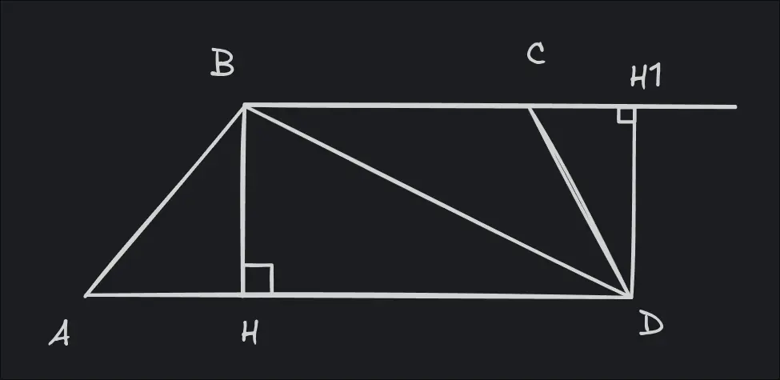

Д-ть: $S=\frac{AD+BC}{2}\cdot BH$

**Док-во:**

Диагональ BD разделяет трапецию на два треугольника ABD и BCD, поэтому $S=S_{ABD}+S_{BCD}$.

AD и BH - основание и высота треугольника ABD соответственно, BC и DH1 - основание и высота треугольника BCD соответственно. Тогда
$S_{ABD}=\frac{AD\cdot BH}{2}$
$S_{BCD}=\frac{BC\cdot DH_{1}}{2}$

Тк DH1=BY, то $S_{BCD}=\frac{BC\cdot BH}{2}$

$S=\frac{BH(AD+BC)}{2}$

*ЧТД*

---

30) Сформулируйте и докажите теоремы об отношении площадей двух треугольников имеющих по равному основанию; равной высоте

Теорема (1) - если основания двух треугольников равны, то их площади относятся как высоты, проведённые к этим основаниям.

Теорема (2) - если высоты двух треугольников равны, то их площади относятся как основания

**Док-во (1):**

Д-ть:
$\dfrac{S_{1}}{S_{2}}=\dfrac{h_{1}}{h_{2}}$

Основания обоих тр-ков = a
h1 - высота первого треугольника
h2 - высота второго треугольника

$S_{1}=\dfrac{a\cdot h_{1}}{2}$
$S_{2}=\dfrac{a\cdot h_{2}}{2}$

$\dfrac{S_{1}}{S_{2}}=\dfrac{a\cdot h_{1}\cdot 2}{a\cdot h_{2}\cdot 2}$

$\dfrac{S_{1}}{S_{2}}=\dfrac{h_{1}}{h_{2}}$

*ЧТД*

**Док-во (2):**

Д-ть:
$\dfrac{S_{1}}{S_{2}}=\dfrac{a_{1}}{a_{2}}$

Высоты обоих тр-ков = h
a1 - основание первого треугольника
a2 - основание второго треугольника

$S_{1}=\dfrac{a_{1}\cdot h}{2}$
$S_{2}=\dfrac{a_{2}\cdot h}{2}$

$\cfrac{S_{1}}{S_{2}}=\cfrac{a_{1}\cdot h\cdot 2}{a_{2}\cdot h\cdot 2}$

$\frac{S_{1}}{S_{2}}=\frac{a_{1}}{a_{2}}$

*ЧТД*

---

31) Сформулируйте и докажите теоремы об отношении площадей двух треугольников имеющих по равному углу

Теорема - если угол одного треугольника равен углу другого треугольника, то площади этих треугольников относятся как произведения сторон, заключающих равные углы

**Док-во:**

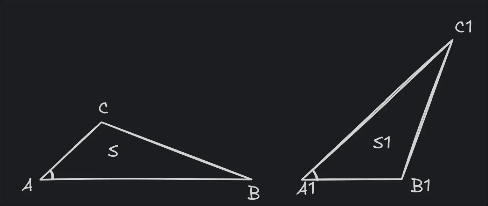

Д-ть:

$\dfrac{S}{S_{1}}=\dfrac{AB\cdot AC}{A_{1}B_{1}\cdot A_{1}C_{1}}$

Наложим $ΔA_{1}B_{1}C_{1}$ на $ΔABC$ так, как указано на рисунке ниже:

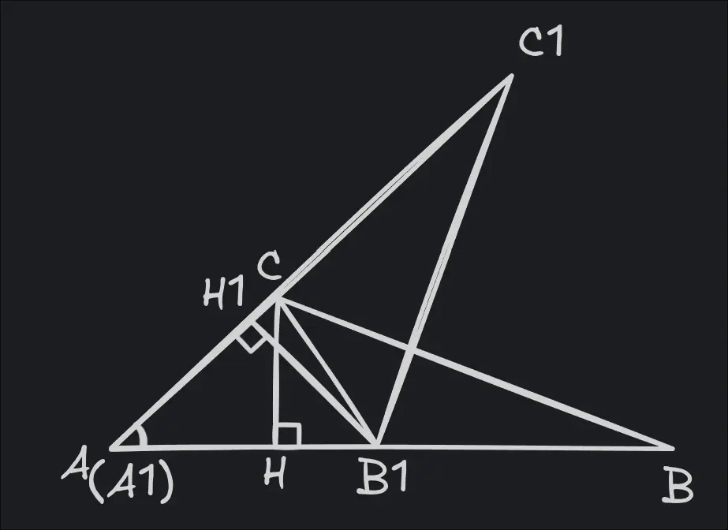

$ΔABC$ и $ΔAB_{1}C$ имеют общую высоту CH, поэтому $\dfrac{S}{S_{ΔAB_{1}C}}=\dfrac{AB}{AB_{1}}$ 
$ΔAB_{1}C$ и $ΔAB_{1}C_{1}$ имеют общую высоту $B_{1}H_{1}$, поэтому $\dfrac{S_{ΔAB_{1}C}}{S_{ΔAB_{1}C_{1}}}=\dfrac{AC}{AC_{1}}$
При перемножении полученных равенств получаем:
$\dfrac{S}{S_{ΔAB_{1}C_{1}}}=\dfrac{AB\cdot AC}{AB_{1}\cdot AC_{1}}$, или же $\dfrac{S}{S_{1}}=\dfrac{AB\cdot AC}{A_{1}B_{1}\cdot A_{1}C_{1}}$

*ЧТД*

---

32) 