
<strong><h2>Часть первая. Без доказательств</h2></strong>

---

## 1
**Дайте определение параллелограмма(пм). Сформулируйте св-ва пма. Сформулируйте признаки пма**

Пм - четырехугольник у которого стороны попарно параллельны

Св-ва:
- Противоположные стороны равны
- Противоположные углы равны
- Диагонали точкой пересечения делятся пополам

Признаки:
- Если в четырехугольнике две стороны равны и параллельны, то это пм
- Если в четырехугольнике противоположные стороны попарно равны, то это пм
- Если в четырехугольнике диагонали пересекаются и точкой пересечения делятся пополам, то это пм	

---

## 2
**Теорема Фалеса**

Если на одной из двух прямых последовательно отложить несколько равных отрезков и через их концы провести паралл. прямые, пересекающие вторую прямую, то они отекут на второй прямой равные между собой отрезки

---

## 3
**Дайте определение треугольника и средней линии треугольника. Сформулируйте теорему о средней линии треугольника**

Треугольник - многоугольник с тремя вершинами. 

Средняя линия треугольника - отрезок, соединяющий середины двух сторон треугольника.

Теорема - cредняя линия треугольника параллельна одной из его сторон и равна половине этой стороны

MN - средняя линия ΔABC

$MN = \dfrac{AC}{2}$

---

## 4
**Дайте определение трапеции, пруг(прямоугольной) трапеции, рб(равнобедренной) трапеции. Сформулируйте св-ва и признаки рб трапеции**

Трапеция - четырехугольник, у которого две стороны параллельны, а две другие стороны не параллельны. Парал. стороны - основания, две другие - боковые стороны.

Трапеция прямоугольная если у нее один угол прямой.

Трапеция рб если ее боковые стороны равны.

Св-ва рб трапеции:
- Углы при основании равны
- Диагонали равны

Признаки рб трапеции:
- Если углы при основании трапеции равны, то она рб
- Если диагонали трапеции равны, то она рб

---

## 5
**Дайте определение трапеции, средней линии трапеции. Сформулируйте теорему о средней линии трапеции**

Трапеция - четырехугольник, у которого две стороны параллельны, а две другие стороны не параллельны. Парал. стороны - основания, две другие - боковые стороны.

Средняя линия трапеции - отрезок, соединяющий середины боковых сторон трапеции.

Теорема - cредняя линия трапеции параллельна основаниям трапеции и равна их полусумме

MN - средняя линия трапеции ABCD

$MN || AD$

$MN = \dfrac{a+b}{2}$

---

## 6
**Сформулируйте теорему Вариньона**

Середины сторон выпуклого четырехугольника являются вершинами параллелограмма

---

## 7
**Дайте определение прямоугольника. Сформулируйте особое св-во прямоугольника. Сформулируйте признак прямоугольника**

Прямоугольник - пм, у которого все углы прямые.

Особое св-во - диагонали прямоугольника равны.

Признак - если в пм-е диагонали равны, то это прямоугольник

---

## 8
**Дайте определение квадрата, ромба. Сформулируйте особое св-во ромба**

Квадрат - прямоугольник, у которого все стороны равны.

Ромб - пм, у которого все стороны равны.

Особое св-во ромба - диагонали ромба взаимно перпендикулярны и делят его углы пополам

---

## 9
**Сформулируйте св-ва площадей многоугольников. Сформулируйте теорему о площади прямоугольника**

Св-ва площадей многоугольников:
- Равные многоугольники имеют равные площади
- Если многоугольник составлен из нескольких многоугольников, то его площади равна сумме площадей этих многоугольников.
- Площадь квадрата равна квадрату его стороны

Теорема о площади прямоугольника - площадь прямоугольника равна произведению его смежных сторон

---

## 10
**Сформулируйте св-ва площадей многоугольников. Сформулируйте теоремы о площади пм-а и площади треугольника**

Св-ва площадей многоугольников:
- Равные многоугольники имеют равные площади
- Если многоугольник составлен из нескольких многоугольников, то его площадь равна сумме площадей этих многоугольников.
- Площадь квадрата равна квадрату его стороны

Теорема о площади пм-а - площадь пм-а равна произведению его основания на высоту

Теорема о площади треугольника - площадь треугольника равна половине произведения его основания на высоту (или как по формуле Герона)

---

## 11
**Сформулируйте следствия теоремы о площади треугольника (площади рст(равностороннего) и пруг(прямоугольного) треугольников)**

Следствие 1 - площадь пруг треугольника равна половине произведения его катетов

Следствие 2 - площадь рст тргеугольника равна $\cfrac{{a^2\cdot \sqrt{ 3 }}}{4}=\cfrac{h^2}{\sqrt{ 3 }}$

---

## 12
**Сформулируйте теорему об отношении площадей двух треугольников имеющих по:
- **Равному углу**
- **Равной стороне**
- **Равной высоте**

Теорема - если угол одного треугольника равен углу другого треугольника, то площади этих треугольников относятся как произведения сторон, заключающих эти углы.

Теорема - если высоты двух треугольников равны, то их площади относятся как основания

Теорема - если основания двух треугольников равны, то их площади относятся как высоты, проведённые к этим основаниям.

---

## 13
**Сформулируйте св-ва площадей многоугольников. Сформулируйте теорему о вычислении площади трапеции**

[Св-ва площадей многоугольников](#10)

Теорема - площадь трапеции равна произведению полусуммы её оснований на высоту (или ее средней линии на высоту)

---

## 14
**Дайте определение окружности, касательной к окружности, хорды, секущей к окружности, центрального и вписанного углов**

Окружность - геом. фигура, сост. из всех точек плоскости, расположенных на заданном расстоянии от данной точки. Данная точка - центр окружности, расстояние - ее радиус (иначе определение звучит так: окружность - геометрическое место точек, равноудаленных от центра)

Касательная к окружности - прямая,имеющая с окружностью только одну общую точку

Секущая к окружности - прямая, имеющая с окружностью две общие точки

Хорда - отрезок, соединяющий любые две точки окружности и при этом не проходящие через ее центр

Центральный угол - угол с вершиной в центре окружности

Вписанный угол - угол, вершина которого лежит на окружности, и стороны которого пересекают окружность

---

## 15
**Дайте определение вписанного и описанного многоугольника. Определите положение центра вписанной и описанной окружностей.**

Если все стороны многоугольника касаются окружности, то окружность называют вписанной в многоугольник, а многоугольник - описанным около этой окружности

Если все вершины многоугольника лежат на окружности, то окружность называется описанной около многоугольника, а многоугольник вписанным в эту окружность

Центр описанной окружности находится на пересечении серединных перпендикуляров к сторонам многоугольника

Центр вписанной окружности находится на пересечении биссектрис углов многоугольника

---

## 16
**Дайте определение пропорциональных отрезков. Дайте определение подобных треугольников.  Сформулируйте теорему об отношении периметров подобных треугольников**

Говорят, что отрезки a и b пропорциональны отрезкам c и d, если $\cfrac{a}{c}=\cfrac{b}{d}$

Два треугольника называют подобными, если их углы соответственно равны и стороны одного треугольника пропорциональны сходственным сторонам другого треугольника

ΔABC ~ ΔMNK, если:

$∠A=∠M, ∠B=∠N, ∠C=∠K$

$\cfrac{AB}{MN}=\cfrac{BC}{NK}=\cfrac{AC}{MK}=k$

Где k - коэффициент подобия

Теорема - Отношение периметров двух подобных треугольников равно коэффициенту подобия
<!--
**Док-во:**
$$k\cdot MN​=AB,⠀k\cdot NK​=BC,⠀k\cdot MK=AC$$
Тогда периметр первого тр-ка:
$$
P_{ΔABC}=k\cdot MN+k\cdot NK+k\cdot MK=k(MN+NK+MK)=k\cdot P_{ΔMNK}
$$
Отсюда:
$$
\frac{P_{ΔABC}}{P_{ΔMNK}}=k⠀или⠀\frac{P_{ΔMNK}}{P_{ΔABC}}=\frac{1}{k}
$$
*ЧТД*
-->

---

## 17
**Сформулируйте признак подобия треугольников по 2-м углам**

Если два угла одного треугольника соответственно равны двум углам другого треугольника, то такие треугольники подобны

---

## 18
**Сформулируйте признак подобия треугольников по 2-м пропорциональным сторонам и углу между ними**

Если две стороны одного треугольника пропорционально равны двум сторонам другого треугольника и углы, заключенные между этими сторонами, равны, то такие треугольники подобны

---

## 19
**Сформулируйте признак подобия треугольников по трем пропорциональным сторонам**

Если три стороны одного треугольника пропорциональны трем сторонам другого, то такие треугольники подобны

---

## 20
**Дайте определение медианы треугольника. Сформулируйте св-ва медиан треугольника**

Медиана треугольника - отрезок, соединяющий вершину треугольника с серединой противоположной стороны

Св-во:  медианы треугольника пересекаются в одной точке и делятся ею в отношении 2 : 1 считая от вершины

---

## 21
**Дайте определение высоты треугольника. Сформулируйте св-во высот треугольника**

Высота треугольника - перпендикуляр, проведенный из вершины треугольника к прямой, содержащей противоположную сторону

Высоты треугольника или их продолжения пересекаются в одной точке

---

## 22
**Определение среднего геометрического двух отрезков. Сформулируйте теоремы о пропорциональных отрезках в прямоугольном треугольнике**

Среднее геометрическое (пропорциональное) двух отрезков - отрезок, длина которого равна квадратному корню произведения длин двух данных отрезков

Пусть даны два отрезка длиной $a$ и $b$. Тогда отрезок длиной $c$ называется их средним геометрическим, если выполняется пропорция:

$\cfrac{a}{c}=\cfrac{c}{b}$

Отсюда следует основная формула:

$c=\sqrt{ a\cdot b }$

c - среднее геометрическое отрезков $a$ и $b$

Теоремы:
- Высота, опущенная из вершины прямого угла на гипотенузу, есть среднее геометрическое между отрезками, на которые она делит гипотенузу
- Катет прямоугольного треугольника есть среднее геометрическое между гипотенузой и проекцией этого катета на гипотенузу
- Три треугольника - исходный прямоугольный и два меньших, образованных высотой, - подобны между собой

---

## 23
**Дайте определение пропорциональных отрезков. Сформулируйте обобщенную теорему Фалеса (теорема о пропорциональных отрезках)**

Говорят, что отрезки a и b пропорциональны отрезкам c и d, если $\cfrac{a}{c}=\cfrac{b}{d}$

Теорема - параллельные прямые, пересекающие стороны угла отсекают на сторонах угла пропорциональные отрезки.

---

## 24
**Сформулируйте и проиллюстрируйте теоремы Чевы, Менелая**

Теорема Чевы - пусть на сторонах $AB, BC, AC$  $ΔABC$ отмечены точки $C_{1}, A_{1}, B_{1}$ соответственно. Тогда прямые $AA_{1}, BB_{1}, CC_{1}$ будут пересекаться в одной точке тогда и только тогда, когда выполняется равенство

$$\frac{AB_{1}}{B_{1}C}\cdot\frac{CA_{1}}{A_{1}B}\cdot\frac{BC_{1}}{C_{1}A}=1$$

Теорема Менелая - точки $A_{1}, B_{1}, C_{1}$ лежат на одной прямой, тогда и только тогда, когда выполняется равенство

$$\frac{AC_1}{C_1B} \cdot \frac{BA_1}{A_1C} \cdot \frac{CB_1}{B_1A} = 1$$

---

## 25
**Дайте определение биссектрисы треугольника. Сформулируйте теорему о биссектрисе внутреннего угла треугольника**

Биссектриса треугольника - отрезок биссектрисы угла треугольника, соединяющий вершину треугольника с точкой противоположной стороны

Теорема - биссектриса треугольника делит его сторону на отрезки, пропорциональные прилежащим к ним сторонам

---

## 26
**Какие точки называются замечательными точками треугольника?**

Центроид (Точка пересечения медиан) - G
- Делит каждую медиану в отношении 2:1, считая от вершины. 

Инцентр (Точка пересечения биссектрис) - I
- Это центр вписанной окружности. Она всегда находится внутри треугольника и равноудалена от всех сторон.

Ортоцентр (Точка пересечения высот) - H

Расположение зависит от типа треугольника:
- В остроугольном - внутри.
- В прямоугольном - совпадает с вершиной прямого угла.
- В тупоугольном - снаружи треугольника.

Циркумцентр (Точка пересечения серединных перпендикуляров) — O
- Точка пересечения перпендикуляров, восстановленных из середин всех трёх сторон треугольника.
- Это центр описанной окружности. Равноудалён от всех вершин.

---
---
---

<strong><h2>Часть вторая. Основные вопросы</h2></strong>

---

## 27
**Сформулируйте св-ва площадей многоугольников. Сформулируйте и докажите теорему о площади прямоугольника.**

Св-ва площадей многоугольников:
- Равные многоугольники имеют равные площади
- Если многоугольник составлен из нескольких многоугольников, то его площади равна сумме площадей этих многоугольников.
- Площадь квадрата равна квадрату его стороны

Теорема о площади прямоугольника - площадь прямоугольника равна произведению его смежных сторон

**Док-во:**

Достроим прямоугольник до квадрата со стороной a+b.

По 3-му св-ву площадей многоугольников площадь этого квадрата равна $(a+b)^2$

Этот квадрат составлен из двух данных прямоугольников и двух квадратов площадями $a^2$ и $b^2$

По 2-му св-ву: $(a+b)^{2}=2S+a^2+b^2$, т.е. $a^2+2ab+b^2=2S+a^2+b^2$

После сокращения получаем $S=ab$

*ЧТД*

---

## 28
**Сформулируйте теоремы о площади пм-а и площади треугольника.**

Теорема о площади пм-а (1) - площадь пм-а равна произведению его основания на высоту

Теорема о площади треугольника (2) - площадь треугольника равна половине произведения его основания на высоту

**Док-во теоремы (1):**

Пм ABCD, площадь - S
AD - нижнее основание
BH, CK ⊥ (AD)
H, K ∈ (AD)

Д-ть:
$S_{ABCD} = AD\cdot BH$

Р-им возможные случаи расположения H на прямой AD:

H = A => пм - прямоугольник, утверждение верно

Р-им первый случай:

1. Пм ABCD состоит из пруг ΔABH и трапеции HBCD => $S_{ABCD}=S_{ΔABH}+S_{HBCD}$
2. Прямоугольник BHKC состоит из пруг ΔCDK и трапеции HBCD => $S_{BHKC}=S_{ΔCDK}+S_{HBCD}$

3. ΔABH и ΔDCK, ∠AHB = ∠K = 90°:
	- ∠A = ∠CDK (нл углы при AB||CD и сек AD)
	- AB = CD - противопол. стороны пма
	
	=> ΔABH и ΔDCK по острому углу и гипотенузе

4. Из п.1 и п.2 => $S_{ABCD}=S_{BHKC}$
5. $S_{BHCK}=BC\cdot BH$, а т.к. BC = AD, то $S_{BHCK}=AD\cdot BH$
6. Из п.4 и п.5 => $S_{ABCD}=AD\cdot BH$

*ЧТД*

**Док-во теоремы (2):**

Д-ть: $S_{ΔABC}=\frac{AB\cdot CH}{2}$

Достроим ΔABC до пма ABCD

ΔABC и ΔCBD:
- CB - общая сторона
- AB = CD (протвопол. ст. пма)
- AC = BD (протвопол. ст. пма)

=> ΔABC = ΔCBD по трем сторонам

$S_{ABCD}=AB\cdot CH=S_{ΔABC}*2$

$S_{ΔABC}=\cfrac{AB\cdot CH}{2}$

*ЧТД*

---

## 29
**Cформулируйте и докажите теорему о вычислении площади трапеции**

Теорема - площадь трапеции равна произведению полусуммы ее оснований на высоту

Д-ть: $S=\cfrac{AD+BC}{2}\cdot BH$

**Док-во:**

Диагональ BD разделяет трапецию на два треугольника ABD и BCD, поэтому $S=S_{ABD}+S_{BCD}$.

AD и BH - основание и высота треугольника ABD соответственно, BC и DH1 - основание и высота треугольника BCD соответственно. Тогда
$S_{ABD}=\frac{AD\cdot BH}{2}$
$S_{BCD}=\frac{BC\cdot DH_{1}}{2}$

Тк DH1=BY, то $S_{BCD}=\frac{BC\cdot BH}{2}$

$$S=\frac{BH(AD+BC)}{2}$$

*ЧТД*

---

## 30
**Сформулируйте и докажите теоремы об отношении площадей двух треугольников имеющих по равному основанию; равной высоте**

Теорема (1) - если основания двух треугольников равны, то их площади относятся как высоты, проведённые к этим основаниям.

Теорема (2) - если высоты двух треугольников равны, то их площади относятся как основания

**Док-во (1):**

Д-ть:
$\dfrac{S_{1}}{S_{2}}=\dfrac{h_{1}}{h_{2}}$

Основания обоих тр-ков = a
h1 - высота первого треугольника
h2 - высота второго треугольника

$S_{1}=\dfrac{a\cdot h_{1}}{2}$
$S_{2}=\dfrac{a\cdot h_{2}}{2}$

$\dfrac{S_{1}}{S_{2}}=\dfrac{a\cdot h_{1}\cdot 2}{a\cdot h_{2}\cdot 2}$

$\dfrac{S_{1}}{S_{2}}=\dfrac{h_{1}}{h_{2}}$

*ЧТД*

**Док-во (2):**

Д-ть:
$\dfrac{S_{1}}{S_{2}}=\dfrac{a_{1}}{a_{2}}$

Высоты обоих тр-ков = h
a1 - основание первого треугольника
a2 - основание второго треугольника

$S_{1}=\cfrac{a_{1}\cdot h}{2}$

$S_{2}=\cfrac{a_{2}\cdot h}{2}$

$\cfrac{S_{1}}{S_{2}}=\cfrac{a_{1}\cdot h\cdot 2}{a_{2}\cdot h\cdot 2}$

$\cfrac{S_{1}}{S_{2}}=\cfrac{a_{1}}{a_{2}}$

*ЧТД*

---

## 31
**Сформулируйте и докажите теоремы об отношении площадей двух треугольников имеющих по равному углу**

Теорема - если угол одного треугольника равен углу другого треугольника, то площади этих треугольников относятся как произведения сторон, заключающих равные углы

**Док-во:**

Д-ть:

$\dfrac{S}{S_{1}}=\dfrac{AB\cdot AC}{A_{1}B_{1}\cdot A_{1}C_{1}}$

Наложим $ΔA_{1}B_{1}C_{1}$ на $ΔABC$ так, как указано на рисунке ниже:

$ΔABC$ и $ΔAB_{1}C$ имеют общую высоту CH, поэтому $\dfrac{S}{S_{ΔAB_{1}C}}=\dfrac{AB}{AB_{1}}$ 

$ΔAB_{1}C$ и $ΔAB_{1}C_{1}$ имеют общую высоту $B_{1}H_{1}$, поэтому $\dfrac{S_{ΔAB_{1}C}}{S_{ΔAB_{1}C_{1}}}=\dfrac{AC}{AC_{1}}$

При перемножении полученных равенств получаем:

$$\dfrac{S}{S_{ΔAB_{1}C_{1}}}=\dfrac{AB\cdot AC}{AB_{1}\cdot AC_{1}}$$или же $$\dfrac{S}{S_{1}}=\dfrac{AB\cdot AC}{A_{1}B_{1}\cdot A_{1}C_{1}}$$
*ЧТД*

---

## 32
**Сформулируйте и докажите св-ва медиан треугольника о равновеликости**

Теорема (1) - медиана треугольника делит его на два равновеликих треугольника
Теорема (2) - три медианы треугольника делят его на 6 равновеликих треугольников

**Док-во (1):**

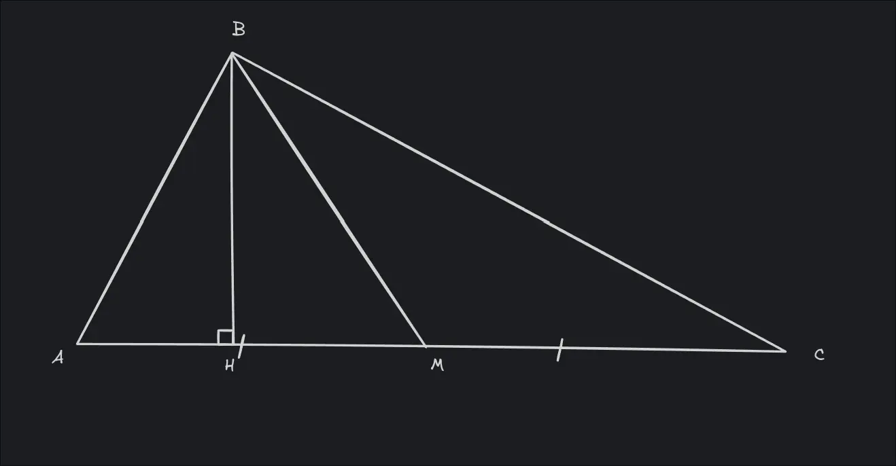

BM - медиана ΔABC => AM = MC
BH - высота ΔABC

$S=\frac{1}{2}ah$

$S_{ΔABM}=AM\cdot BH$
$S_{ΔBMC}=MC\cdot BH=AM\cdot BH$

=> $S_{ΔABM}=S_{ΔBMC}$

*ЧТД*

**Док-во (2):**

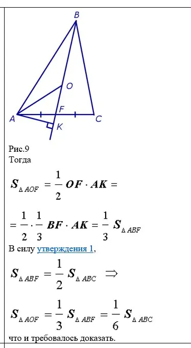

Здесь короче O - точка пересечения медиан и так можно доказать для каждого из мелких треугольников
Утверждение 1 - первая теорема этого пункта

**Другое док-во(2)(сложнее):**

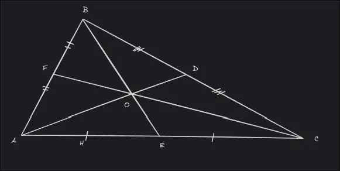

OF - медиана ΔAOB => $S_{ΔAOF}=S_{ΔFOB}$ => $S_{ΔAOB}=2S_{ΔAOF}=2S_{ΔFOB}$
То же самое (расписать) для ΔAOC, ΔBOC...
BE - медиана ΔABC => $S_{ΔABE}=S_{ΔBEC}$
$2S_{ΔAOF}+S_{ΔAOE}=2S_{ΔDOC}+S_{ΔAOE}$ => $S_{ΔAOF}=S_{ΔCOD}$

Так же расписываем для любой другой пары больших тр-ков, например ΔADC и ΔABD
Тогда $S_{ΔCOE}=S_{ΔBOF}$

Из всего док-ва выше следует, что:
$S_{ΔAOF}=S_{ΔFOB}=S_{ΔBOD}=S_{ΔDOC}=S_{ΔCOE}=S_{ΔAOE}$

*ЧТД*

---

## 33
**Сформулируйте и докажите теорему Пифагора**

Теорема - в прямоугольном треугольнике квадрат гипотенузы равен сумме квадратов катетов

**Док-во:**

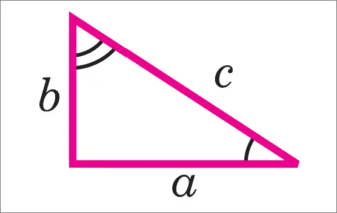

Д-ть: $c^2=a^2+b^2$

Достроим треугольник до квадрата со стороной a+b, как показано на рисунке

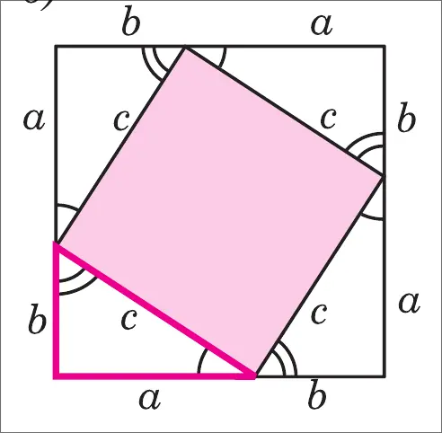

$S_{квадрата}=(a+b)^2$
Также этот квадрат составлен из 4-х прямоугольных треугольников, площадь каждого из которых равна $ab\frac{1}{2}$ и из квадрата со стороной c, поэтому $S_{квадрата}=ab\frac{4}{2}+c^2$, т.е.

$$a^2+2ab+b^2=2ab+c^2$$
$$a^2+b^2=c^2$$

*ЧТД*

---

## 34
**Сформулируйте и докажите обратную теорему Пифагора**

Теорема - если квадрат одной стороны треугольника
­равен сумме квадратов двух других сторон, треугольник прямоугольный

**Док-во:**

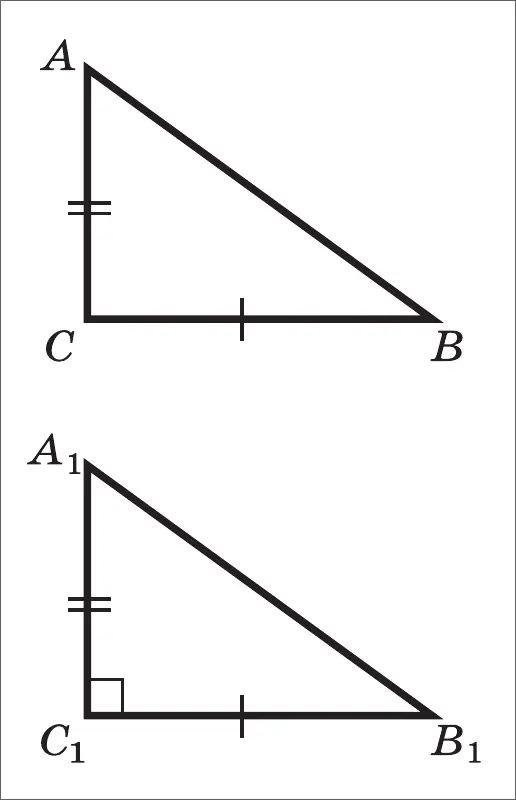

$ΔA_{1}B_{1}C_{1}, ∠C_{1}=90°$
По т. Пифагора $A_{1}B_{1}^{2}=A_{1}C_{1}^2+B_{1}C_{1}^2$, значит, $A_{1}B_{1}^2=AC^2+BC^2$
Но по условию теоремы $AC_{2}+BC^2=AB^2$ => $A_{1}B_{1}^2=AB^2$ => $A_{1}B_{1}=AB$

$ΔABC=ΔA_{1}B_{1}C_{1}$ по трем сторонам, поэтому $∠C=∠C_{1}$, т.е. $ΔABC$ прямоугольный с $∠C=90°$

*ЧТД*

---

## 35
**Укажите все формулы площади треугольника. Выведите формулу площади равностороннего треугольника**

a - основание треугольника
h - высота к нему
a, b, c - стороны тр-ка
p - полупериметр
R - радиус описанной окружности
r - радиус вписанной окружности

$$S=\frac{1}{2}ah
=\sqrt{ p(p-a)(p-b)(p-c) }
=\cfrac{a\cdot b\cdot c}{4R}
=r\cdot p
$$
В пруг треугольнике:
a, b - катеты
$$S=\frac{1}{2}ab$$
В р-ст треугольнике:
$$a = b = c$$
$$p = 3a$$
Так как рст треугольник, то высота - медиана
Значит по т. Пифагора:
$$h^2=a^2- (\frac{a}{2})^2=a^2-\frac{a^2}{4}=\frac{3a^2}{4}$$
$$h=\frac{a\sqrt{ 3 }}{2}$$
Тк $S=\frac{1}{2}ah$, то 
$$
S=\frac{1}{2}a\cdot \frac{a\sqrt{ 3 }}{2}=\frac{a^2\sqrt{ 3 }}{4}
$$

---

## 36
**Дайте определение подобных треугольников. Сформулируйте и докажите теорему об отношении площадей подобных треугольников**

Два треугольника называют подобными, если их углы соответственно равны и стороны одного треугольника пропорциональны сходственным сторонам другого треугольника

$$S_{ΔABC}=S,⠀S_{ΔMNK}=S_{1}$$

ΔABC ~ ΔMNK, если:

$∠A=∠M, ∠B=∠N, ∠C=∠K$

$\cfrac{AB}{MN}=\cfrac{BC}{NK}=\cfrac{AC}{MK}=k$   *(2)*

Где k - коэффициент подобия

Теорема - отношение площадей двух подобных треугольников равно квадрату коэффициента подобия

**Док-во:**

$$k\cdot MN​=AB,⠀k\cdot NK​=BC,⠀k\cdot MK=AC$$
Тк $∠A=∠M$, то
$$\frac{S}{S_{1}}=\frac{AB\cdot AC}{MN\cdot MK}$$
по [пункту 31](#31).
Из определения имеем: 

$$\frac{AB}{MN}=k,⠀\frac{AC}{MK}=k,⠀поэтому⠀\frac{S}{S_{1}}=k^2$$

*ЧТД*

---

## 37
**Дайте определение синуса, косинуса, тангенса острого угла прямоугольного треугольника. Докажите основное тригонометрическое тождество. Найдите значения синуса, косинуса, тангенса для углов 30°, 45°, 60°**

Синус острого угла прямоугольного треугольника - отношение противолежащего катета к гипотенузе

Косинус острого угла прямоугольного треугольника - отношение прилежащего катета к гипотенузе

Тангенс острого угла прямоугольного треугольника - отношение противолежащего катета к прилежащему катету, т.е. отношение синуса к косинусу этого угла

*Основное(главное) тригонометрическое тождество* - $$\sin^2α+\cos^2α=1$$
**Док-во:**

$ΔABC\simΔA_{1}B_{1}C_{1}$ по [первому признаку подобия треугольников](#17), поэтому 
$$\frac{AB}{A_{1}B_{1}}=\frac{BC}{B_{1}C_{1}}=\frac{AC}{A_{1}C_{1}}$$
Из этих равенств следует, что $\cfrac{BC}{AB}=\cfrac{B_{1}C_{1}}{A_{1}B_{1}}$
т.е. $\sin A=\sin A_{1}$

Аналогично $\cfrac{AC}{AB}=\cfrac{A_{1}C_{1}}{A_{1}B_{1}}$
т.е. $\cos A=\cos A_{1}$

И $\cfrac{BC}{AC}=\cfrac{B_{1}C_{1}}{A_{1}C_{1}}$
т.е. $\tan A=\tan A_{1}$

Из определений синуса и косинуса в этом пункте получаем
$$\sin^{2}A+\cos^{2}A=\frac{BC^2}{AB^2}+\frac{AC^2}{AB^2}=\frac{BC^2+AC^2}{AB^2}$$
По т. Пифагора $BC^2+AC^2=AB^2$ => $$\sin^{2}A+\cos^{2}A=1$$
*ЧТД*

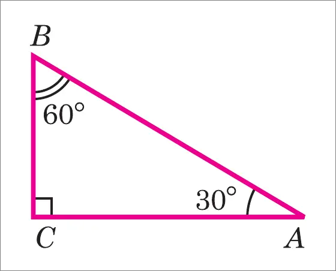

Так как катет, лежащий против угла в 30°, равен половине гипотенузы, то
$\cfrac{BC}{AB}=\cfrac{1}{2}$. $\cfrac{BC}{AB}=\sin A=\sin 30°=\cos B=\cos 60°$
Итак,
$$\sin 30°=\cos 60°=\frac{1}{2}$$
Из основного тригонометрического тождества получаем
$$\cos 30°=\sqrt{ 1-\sin^{2}30° } = \sqrt{ 1-\frac{1}{4} } = \frac{\sqrt{ 3 }}{2}$$

$$\sin 60°=\sqrt{ 1-\cos^{2}60° }=\sqrt{ 1-\frac{1}{4} }=\frac{\sqrt{ 3 }}{2}$$
По определению тангенса находим$$\tan 30° = \frac{\sin 30°}{\cos 30°}=\frac{1}{\sqrt{ 3 }}=\frac{\sqrt{ 3 }}{3}$$

$$\tan 60°=\frac{\sin 60°}{\cos 60°}=\sqrt{ 3 }$$
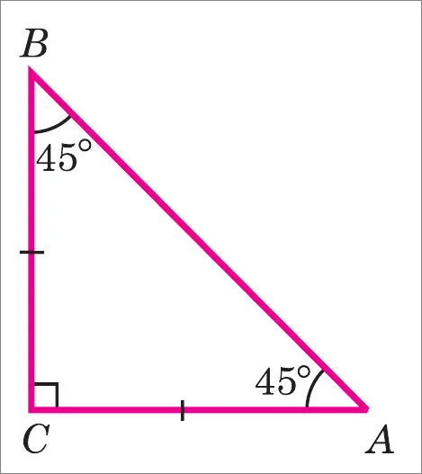

По т. Пифагора $AB^2=AC^2+BC^2=2AC^2=2BC^2$ => $\cfrac{AB}{\sqrt{ 2 }}$, следовательно
$$\sin 45°=\sin A=\frac{BC}{AB}=\frac{1}{\sqrt{ 2 }}=\frac{\sqrt{ 2 }}{2}$$

$$\cos 45°=\cos A=\frac{BC}{AB}=\frac{1}{\sqrt{ 2 }}=\frac{\sqrt{ 2 }}{2}$$

$$\tan 45°=\tan A=\frac{BC}{AC}=1$$

*Итоговая таблица:*

|   α   |           30°           |           45°           |           60°           |
| :---: | :---------------------: | :---------------------: | :---------------------: |
| sin α |     $\cfrac{1}{2}$      | $\cfrac{\sqrt{ 2 }}{2}$ | $\cfrac{\sqrt{ 3 }}{2}$ |
| cos α | $\cfrac{\sqrt{ 3 }}{2}$ | $\cfrac{\sqrt{ 2 }}{2}$ |     $\cfrac{1}{2}$      |
| tg α  | $\cfrac{\sqrt{ 3 }}{3}$ |           $1$           |      $\sqrt{ 3 }$       |

---

## 38
**Дайте определение касательной к окружности. Сформулируйте и докажите теорему о касательной к окружности и радиусе, проведенном в точку касания (свойство касательной к окружности)**

Касательная к окружности - прямая, имеющая с окружностью только одну общую точку

Теорема - касательная к окружности перпендикулярна радиусу, проведенному в току касания

**Док-во:**

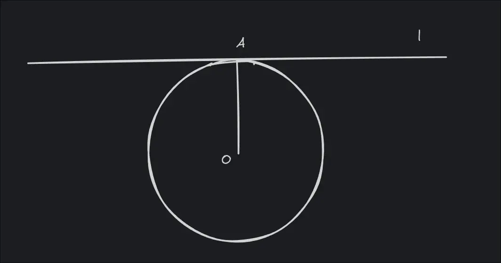

Окр(O, OA)
OA = R
l - касательная к Окр(O, R)

Д-ть: $OA⊥l$

Предположим, что OA не перпендикулярно l, тогда можно опустить $OB ⊥ l, B ∈ l$, причем $A\neq B$ (тк OA не перп. l, B не совпадает с A)

В пруг треугольнике OAB катет OB меньше гипотенузы OA
но OA - радиус окр, значит $OB<R$
Тогда точка B лежит внутри окружности

Отложим на прямой l по другую сторону от B точку С так, что BC = AB
Треугольники OAB и OBC равны по двум катетам, поэтому OC = OA = R

Тогда получается, что точки A и C обе лежат на прямой l и обе находятся на расстоянии R от центра O, что означает, что прямая l пересекает окружность в двух точках A и C, а это противоречит условию, что l - касательная, следовательно наше предположение, что OA не перпендикулярно l неверно

Следовательно, $OA ⊥ l$

*ЧТД*

---

## 39
**Дайте определение касательной к окружности. Сформулируйте и докажите теорему о
прямой, проходящей через конец радиуса, лежащего на окружности, перпендикулярно к этому
радиусу (признак касательной к окружности)**

Касательная к окружности - прямая, имеющая с окружностью только одну общую точку

Теорема - прямая, проходящая через конец радиуса, лежащего на окружности, перпендикулярно этому радиусу - касательная

**Док-во:**

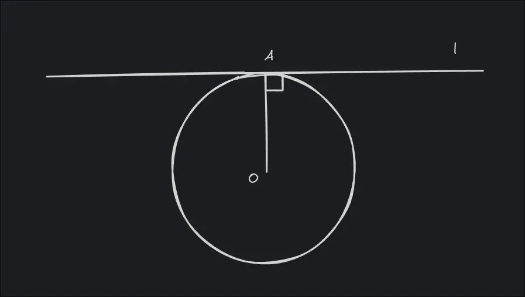

OA = R
Д-ть: l - касательная к Окр(O, R)

Предположим, что прямая l - не касательная, тогда она пересекает (она точно пересекает где-то, т.к. сказано про точку A) окружность еще и в точке B. Тк OA перп. R, то $∠OAB=90°$
Значит в треугольнике OAB угол при вершине A прямой
Но тогда сторона OB - гипотенуза, значит OB > OA
Однако OA и OB - радиусы одной и той же окружности, следовательно OB = OA

Получается противоречие, что означает, что наше предположение неверно

Следовательно, прямая l имеет с окружностью только одну общую точку A, то есть является касательной

*ЧТД*

---

## 40
**Дайте определение центрального и вписанного углов. Сформулируйте и докажите теорему о величине вписанного угла. Сформулируйте следствия теоремы о величине вписанного угла**

Вписанный угол - угол, вершина которого лежит на окружности, а стороны пересекают окружность

Теорема - вписанный угол измеряется половиной дуги, на
которую он опирается

**Док-во:**

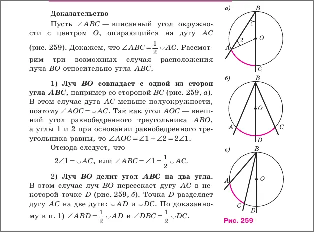
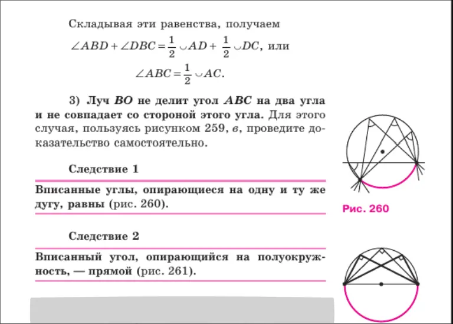

док-во (3): там угол ABD как из первого случая, значит он равен половине AD, то есть равен $$\frac{AC}{2} + \frac{CD}{2} = ABC + CBD$$
А по первому случаю $CBD = CD/2$ => $$ABC = \frac{AC}{2}$$
*ЧТД*

---

## 41
**Дайте определение центрального и вписанного углов. Сформулируйте и докажите теорему о произведении отрезков двух хорд**

Вписанный угол - угол, вершина которого лежит на окружности, а стороны пересекают окружность

Центральный угол - угол, вершина которого лежит на центре окружности, а стороны пересекают окружность

Теорема - если две хорды окружности пересекаются, то произведение отрезков одной хорды равно произведению отрезков другой хорды

**Док-во:**

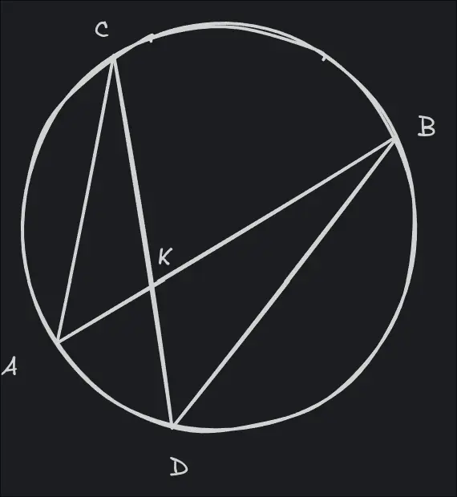

Д-ть: $AK⋅KB=CK⋅KD$

$∠AKC=∠DKB$, так как это вертикальные углы
$∠ACK=∠DBK$, тк вписанные углы, опир. на одну дугу
=> $△AKC\sim △DKB$
Из этого получаем
$$\frac{AK}{KD}=\frac{CK}{KB}$$
То есть $$AK\cdot KB=CK\cdot KD$$

*ЧТД*

---

## 42
**Сформулируйте и докажите теорему о медиане, проведенной к гипотенузе прямоугольного треугольника (прямую и обратную)**

Прямая теорема (1) - медиана, проведённая к гипотенузе прямоугольного треугольника, равна половине гипотенузы

Обратная теорема (2) - если в треугольнике медиана равна половине стороны, к которой она проведена, то треугольник прямоугольный

**Док-во(1):**

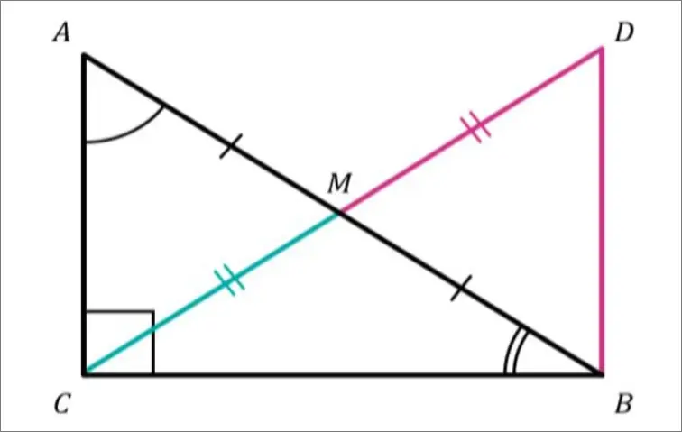

$AM=MB=\frac{AB}{2}$

Д-ть: CM = AB/2

$△ACM$ и $△BDM$
- AM = MB
- CM = CD
- ∠AMC = ∠BMD(верт. углы)
=> △ACM = △BDM по двум сторона и углу между ними, следовательно:
- ∠CBD = 90 тк ∠DBM(=∠CAM) + ∠ABC = 90 => ∠DCB = ∠ABC, значит ∠ACM = 90 - ∠ABC = ∠CAM

Из этого следует, что тр-к CMB и ACM - рст, значит CM = AM = MB

*ЧТД*

**Док-во(2):**

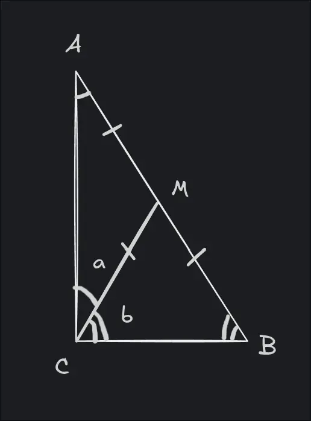

Д-ть: C = 90

Там расписать про рб треугольники и равные углы при основаниях
... =>
2a + 2b = 180
a + b = C = 90

*ЧТД*

---

## 43
**Дайте определение центрального и вписанного углов. Сформулируйте и докажите теорему о квадрате касательной**

[Определения центрального и вписанного углов](#41)

Теорема - если из точки, лежащей вне окружности, проведены касательная и секущая, то квадрат касательной равен произведению всей секущей на её внешнюю часть

**Док-во:**

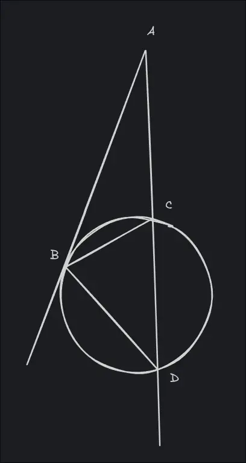

Д-ть: $AB^2=AC\cdot AD$

$△ABC$ и $△ABD$
- угол ∠ABC равен углу ∠ADB (так как угол между касательной и хордой равен вписанному углу опирающемуся на ту же дугу)
- ∠BAD - общий
=> $△ABC\sim △ABD$ по 2-м углам => $$\frac{AB}{AD}=\frac{AC}{AB}$$
=> $$AB^2=AC\cdot AD$$

*ЧТД*

---

## 44
**Дайте определение центрального и вписанного углов. Сформулируйте и докажите теорему о двух секущих**

[Определения центрального и вписанного углов](#41)

Теорема - если из одной точки, лежащей вне окружности, проведены две секущие, то произведение всей первой секущей на её внешнюю часть равно произведению всей второй секущей на её внешнюю часть

**Док-во:**

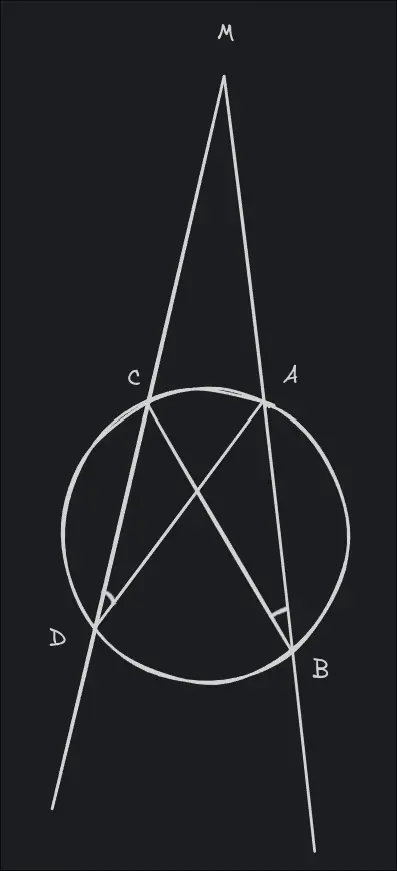

Д-ть: $MA\cdot MB=MC\cdot MD$

△MAD и △MCB:
- ∠M - общий
- ∠MDA = ∠MBC(впис. углы опир. на одну и ту же дугу)
=> $△MAD \sim △MCB$ => 

$$\frac{MC}{MA}=\frac{MB}{MD}$$

=>

$$MA\cdot MB=MC\cdot MD$$

*ЧТД*

---

## 45
**Дайте определение центрального и вписанного углов. Сформулируйте и докажите теорему об угле между касательной и хордой**

[Определения центрального и вписанного углов](#41)

Теорема - гол между касательной и хордой, проведённой через точку касания, равен половине градусной меры дуги, которую стягивает эта хорда

**Док-во:**

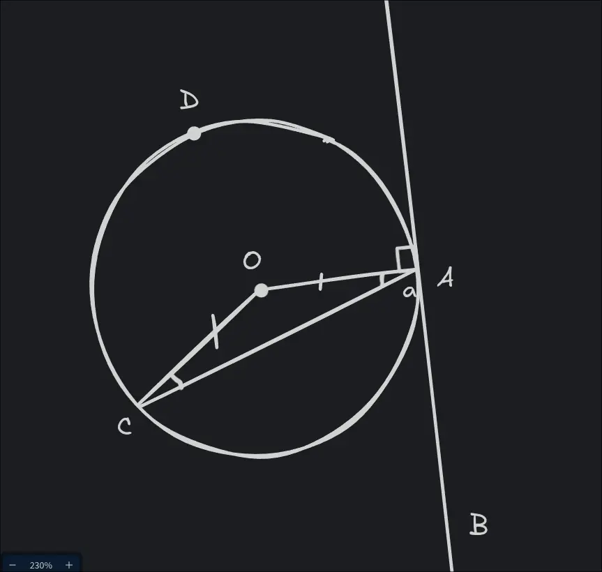

BAC = a

Д-ть: угол CAB = CA/2

тк C и A лежат на окружности, то OA = OC = R, они радиусы
треугольник AOC - рб, AC - основание => OCA = OAC = 90 - a(тк радиус перпендикулярен секущей)

AOC = дуга AC = 180 - (90-a)*2 = 2a

А так как CAB = a, то CAB = AC/2

*ЧТД*

---

## 46
**Дайте определение центрального и вписанного углов. Сформулируйте и докажите теорему об угле между пересекающимися хордами**

[Определения центрального и вписанного углов](#41)

Теорема - угол между хордами окружности измеряется полусуммой двух дуг этой окружности, заключённых между сторонами угла и их продолжениями

**Док-во:**

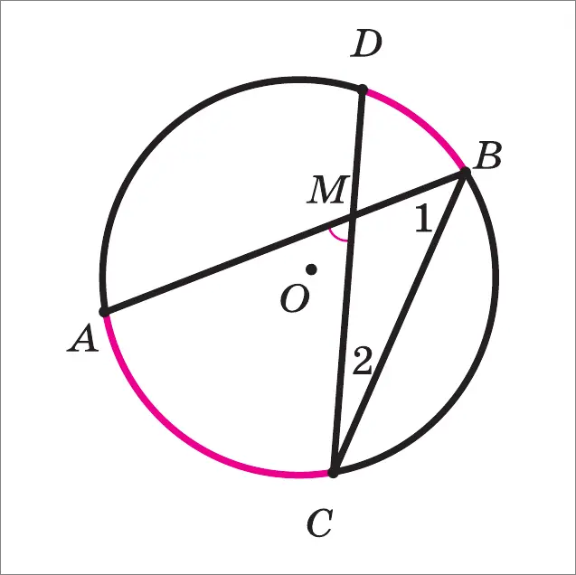

По [теореме о вписанном угле](#40) угол 1 равен AC/2, угол 2 равен BD/2, угол AOC - внешний угол треугольника CMB, значит AOC = 1 + 2

*ЧТД*

---

## 47
**Дайте определение центрального и вписанного углов. Сформулируйте и докажите теорему об угле между секущими**

[Определения центрального и вписанного углов](#41)

Теорема - угол между секущими окружности, пересекающимися в точке, внешней относительно этой окружности, измеряется полуразностью двух дуг этой окружности, заключённых внутри угла

**Док-во:**

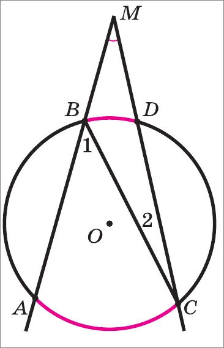

По [теореме о вписанном угле](#40) угол 2 равен BD/2, угол 1 равен AC/2, угол 1 равен угол M + угол 2, тк угол 1 внешний для тр-ка MBC, значит угол M равен угол 1 - угол 2 = (AC-BD)/2

*ЧТД*

---

## 48
**Дайте определение окружности, вписанной в многоугольник. Сформулируйте и докажите теорему о том, можно ли в треугольник вписать окружность, и сколько их может быть**

Если все стороны многоугольника касаются окружности, то окружность называется вписанной в многоугольник, а многоугольник - описанным около окружности

Теорема - в любой треугольник можно вписать окружность, и при этом только одну

**Док-во:**

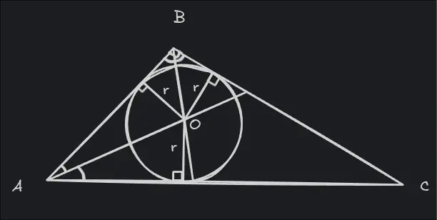

Из свойства биссектрисы:
- Любая точка биссектрисы угла равноудалена от его сторон.

Так как точка O лежит на биссектрисе угла A, то расстояния от O до сторон AB и AC равны.

Так как O лежит на биссектрисе угла B, то расстояния от O до сторон AB и BC тоже равны.

Следовательно, расстояния от точки O до всех трёх сторон треугольника одинаковы.

Обозначим это расстояние через r.

Теперь построим окружность с центром O и радиусом r.

Так как расстояние от центра окружности до каждой стороны равно радиусу, окружность касается всех трёх сторон треугольника.

*Значит, окружность можно вписать*

Предположим, что в треугольник можно вписать две разные окружности.

Тогда у них были бы разные центры.

Но центр вписанной окружности должен быть равноудалён от всех сторон треугольника.

Точка, равноудалённая от сторон угла, лежит на его биссектрисе. Значит, центр вписанной окружности обязан лежать одновременно на биссектрисах всех углов треугольника.

Однако биссектрисы треугольника пересекаются только в одной точке.

Получаем противоречие.

*Следовательно, вписанная окружность только одна*

*ЧТД*

---

## 49
**Дайте определение окружности, вписанной в многоугольник. Сформулируйте и докажите теорему о свойстве сторон описанного четырёхугольника**

[Определение окружности, вписанной в многоугольник](#48)

Теорема - в любом описанном четырёхугольнике суммы
противоположных сторон равны

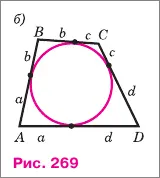

Это свойство легко установить, используя рисунок 269(б), на котором одними и теми же буквами обозначены равные отрезки касательных. В самом деле, $AB + CD = a+b+c+d$, $BC + AD = a+b+c+d$, поэтому 

$$AB + CD = BC + AD$$

*ЧТД*

Оказывается, верно и обратное утверждение: если суммы противоположных сторон выпуклого четырёхугольника равны, то в него можно вписать окружность

---

## 50
**Дайте определение окружности, вписанной в многоугольник. Сформулируйте и докажите теорему о том, в какой четырёхугольник можно вписать окружность**

[Определение окружности, вписанной в многоугольник](#48)

Теорема - окружность можно вписать только в четырехугольник, у которого суммы противоположных сторон равны

Док-во следует из [49 пункта](#49) или:

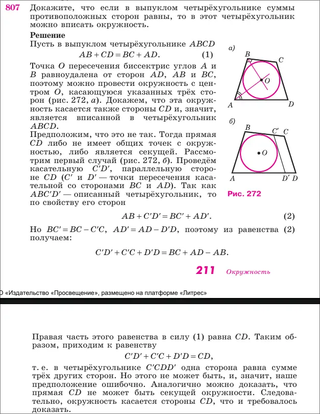

---

## 51
**Дайте определение окружности, описанной около многоугольника. Сформулируйте и докажите теорему о том, можно ли около треугольника описать окружность, и сколько их может быть**

Если все вершины многоугольника лежат на окружности, то окружность называется описанной около многоугольника, а многоугольник — вписанным в эту окружность

Теорема - около любого треугольника можно описать окружность, и притом только одну

**Док-во:**

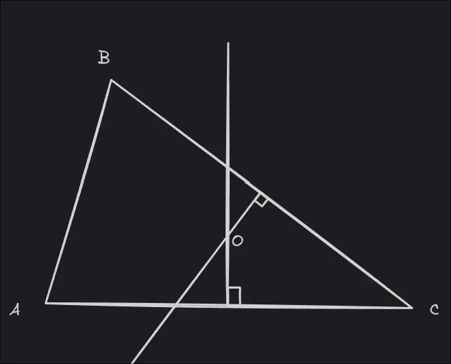

Рассмотрим серединные перпендикуляры к сторонам треугольника:
- к AB
- к BC
Обозначим их точку пересечения через O

Свойство серединного перпендикуляра:

Любая точка серединного перпендикуляра равноудалена от концов отрезка

Отсюда:
- O равноудалена от A и B, значит OA=OB
- O равноудалена от B и C, значит OB=OC

Следовательно OA = OB = OC

Теперь построим окружность с центром O и радиусом OA

*Она проходит через точки A, B и C, значит описана около треугольника*

Предположим, что около треугольника можно описать две разные окружности с центрами O1 и O2

Тогда:
- O1 равноудалена от A, B, C
- значит она лежит на серединных перпендикулярах к AB и BCB
- то же самое верно для O2

Но серединные перпендикуляры пересекаются в одной единственной точке

Следовательно O1 = O2

*Значит, окружность единственна*

*ЧТД*

---

## 52
**Дайте определение окружности, описанной около многоугольника. Сформулируйте и докажите теорему о свойстве углов вписанного четырёхугольника (о сумме противолежащих углов)**

[Определение окружности, описанной около многоугольника](#51)

Теорема - в любом вписанном четырёхугольнике сумма противоположных углов равна 180°

**Док-во:**

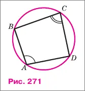
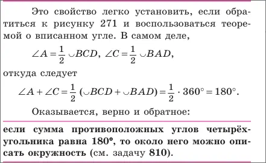

---

## 53
**Дайте определение окружности, описанной около многоугольника. Сформулируйте и докажите теорему о свойстве углов вписанного четырёхугольника (о равенстве углов между диагоналями и прилежащими сторонами)**

Теорема - во вписанном четырёхугольнике угол между диагональю и стороной равен углу между другой диагональю и противоположной стороной

Пусть четырёхугольник ABCD вписан в окружность.

Тогда:
∠ACB=∠ADB

и также
∠CAD=∠CBD

Потому что углы, опирающиеся на одну и ту же дугу, равны

---

## 54
**Дайте определение окружности, описанной около многоугольника. Сформулируйте и докажите теорему о том, около какого четырёхугольника можно описать окружность**

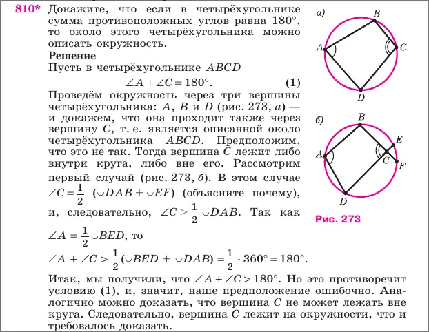

---

## 55
**Сформулируйте и докажите теорему о площади описанного многоугольника**

Д-ть: S=pr,
где:
- S - площадь многоугольника,
- p - его полупериметр,
- r - радиус вписанной окружности.

Пусть дан описанный многоугольник.

Обозначим:
- его стороны: a1,  a2,  a3,  …,  an
- радиус вписанной окружности — rrr.

Так как окружность вписана, расстояние от её центра до каждой стороны равно r

Разобьём многоугольник на треугольники, соединяя центр окружности со всеми вершинами

Тогда получатся треугольники:

- с основаниями a1,a2,…,an
- и высотой r.

Площадь каждого такого треугольника:

$$S_{1}=\frac{1}{2}a_{1}r$$

$$S_{2}=\frac{1}{2}a_{2}r$$

И тд

Сложим площади всех треугольников:

$$S=\frac{1}{2}r(a_{1}+a_{2}+\dots+a_{n})$$

$$P=a_{1}+a_{2}+\dots+a_{n}$$

$$p=\frac{P}{2}$$

$$S=\frac{1}{2}Pr=pr$$

*ЧТД*

---
---
---

<strong><h2>G30M37RY 1S 0V3R</h2></strong>

