<center><strong><h2>Тепловые явления</h2></strong></center>

---

## 1 
**Температура. Связь температуры со средней кинетической энергией теплового движения частиц. Температурные шкалы. Абсолютный нуль температур. Тепловое равновесие. Измерение температуры термометром**

Тепловое движение - беспорядочное движение частиц, из которых состоит тело

Температура - физическая величина, характеризующая степень нагретости тела или системы

Шкала Цельсия  - 0 °C — плавление льда, 100 °C — кипение воды

Шкала Кельвина -  СИ, отсчёт от абсолютного нуля (-273.15 °C = 0 K), градусная мера совпадает со шкалой Цельсия

T = t + 273

где T - температура по Кельвину, t - температура по Цельсию

Абсолютный нуль - температура, при которой тепловое движение частиц полностью прекращается. Достичь невозможно

Тепловое равновесие - состояние, при котором все части системы имеют одинаковую температуру и теплообмен между ними отсутствует

Измерение температуры термометром основано на изменении физических свойств вещества при нагревании (объёма жидкости, электрического сопротивления и др.)

---

## 2
**Внутренняя энергия. Способы изменения внутренней энергии тела. Примеры. Первый закон термодинамики. Закон сохранения энергии в механических и тепловых процессах. Примеры превращения механической энергии во внутреннюю и внутренней в механическую**

Внутренняя энергия - сумма кинетической энергии теплового движения частиц и потенциальной энергии их взаимодействия

Можно изменить совершением работы над телом($E_{внутр.}$ увеличивается), самим телом($E_{внутр.}$ уменьшается), теплопередачей

Примеры:
- Удар по телу(оно нагревается)
- Опустить ложку в горячий чай(чай остывает быстрее, ложка нагревается)

ЗСЭ - энергия не возникает из ниоткуда и не исчезает, а только переходит из одного вида в другой
- Механическая во внутреннюю - трение, удар (кинетическая переходит в тепловую)
- Внутренняя в механическую - пар давит на поршень (тепловая переходит в кинетическую)

1 закон термодинамики - изменение внутренней энергии термодинамической системы равно количеству теплоты, переданному системе, за вычетом работы, совершённой системой над внешними телами

$$ΔU = Q - A$$


---

## 3
**Виды теплопередачи (полное определение с описанием механизма теплопередачи, особенности каждого вида теплопередачи). Примеры разных видов теплопередачи в природе и технике (нагрев воды в кастрюле, образование бриза, система отопления, термос)**

Теплопередача - процесс передачи тепловой энергии от более нагретого тела к менее нагретому

Теплопередача - процесс изменения внутренней энергии без совершения работы

Теплопроводность - перенос энергии за счёт взаимодействия частиц. Не работает в вакууме, лучше всего в металлах, без переноса в-ва. Пример - нагрев металлической ложки в чае

Конвекция - Передача энергии потоками жидкости или газа. Работает только в жидкостях и газах. Примеры - нагревание воды в кастрюле, система отопления, образование бриза

Излучение - перенос энергии электромагнитными волнами. Работает везде, лучше всего в вакууме. Примеры - тепло от костра, нагревание Земли Солнцем

Термос:
- вакуум между стенками уменьшает теплопроводность и конвекцию
- зеркальные поверхности уменьшают излучение

---

## 4
**Количество теплоты и удельная теплоёмкость вещества, теплоёмкость тела (определение, формула, единицы измерения). Уравнение теплового баланса**

Количество теплоты ($Q$) — энергия, которую тело получает или теряет в процессе теплообмена

$$Q=cmΔt,[Q]=[Дж]$$


Удельная теплоёмкость ($c$) - количество теплоты, нужное для нагревания 1 кг вещества на 1°C.

$$c=\frac{Q}{mΔt},[c]=\left[ \frac{Дж}{кг\cdot °C} \right]$$


Теплоемкость тела ($C$) - количество теплоты, необходимое для нагрева тела на 1°С

$$C=cm,[C]=\left[ \frac{Дж}{°С} \right]$$


Уравнение теплового баланса - В замкнутой системе количество теплоты, отданное одними телами, равно количеству теплоты, полученному другими телами
$Q_{отд}=Q_{пол}$

---

## 5
**Плавление и отвердевание кристаллических веществ. Примеры. Температура плавления и кристаллизации. Удельная теплота плавления (определение, формула, единицы измерения). График плавления и отвердевания на примере воды. Изменение внутренней энергии при плавлении, отвердевании вещества**

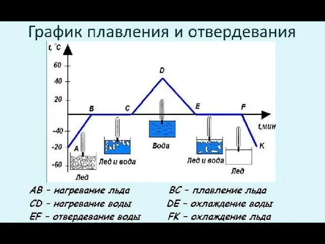

Плавление - переход вещества из твёрдого агрегатного состояния в жидкое (поглощает тепло)

Отвердевание (кристаллизация) — переход из жидкого агрегатного состояния в твёрдое (выделяет тепло)

Температура плавления (кристаллизации) - температура, при которой вещество плавится/кристаллизуется, при этом температура тела не изменяется

Удельная теплота плавления (λ) — количество теплоты, нужное для перевода 1 кг твёрдого вещества в жидкость при температуре плавления

$$λ=\frac{Q}{m},[λ]=\left[ \frac{Дж}{кг} \right]$$


---

## 6
**Испарение и конденсация. Примеры наблюдения в быту и в природе. Факторы, влияющие на скорость испарения, и их объяснение. Насыщенный и ненасыщенный пар**

Испарение - парообразование, происходящее с поверхности жидкости при любой температуре. Примеры - высыхание белья, луж. Внутренняя энергия жидкости уменьшается

Конденсация - переход из газообразного агрегатного состояния в жидкое. Примеры - образование облаков, росы, запотевание окон. Внутренняя энергия жидкости увеличивается

Скорость испарения зависит от:
- Температуры(прямо проп.)
- Площади пов-сти(прямо проп.)
- Рода жидкости(эфир быстрее воды)
- Движения воздуха(чем сильнее ветер, тем быстрее жидкость испаряется)
- Влажности(обратно проп.)

Насыщенный пар - пар, который находится в динамическом равновесии со своей жидкостью (состояние, при котором скорость испарения жидкости равна скорости конденсации пара)

Ненасыщенный пар - пар, плотность которого меньше плотности насыщенного пара при данной температуре

---

## 7
**Абсолютная и относительная влажность воздуха (определение, формула, единицы измерения). Точка росы. Приборы для определения относительной влажности (устройство и принцип действия)**

Абсолютная влажность($ρ$) - масса водяного пара, содержащаяся в 1 м³ воздуха

$$ρ=\frac{m}{V},[ρ]=\left[ \frac{г}{м^3} \right]$$


Относительная влажность($φ$) - отношение абсолютной влажности к максимально возможной при данной температуре

$$φ = \left( \frac{ρ}{ρ_{0}} \right)\cdot 100\%$$


Приборы:
- Психрометр (два термометра: сухой, влажный. По разности покуазаний измеряют влажность воздуха)
- Гигрометр - прибор для непосредственного измерения влажности воздуха (волосной/конденсационный)

---

## 8
**Кипение. Описание процесса. Условие кипения жидкости. Зависимость температуры кипения от атмосферного давления. Удельная теплота парообразования (определение, формула, единицы измерения). График кипения и конденсации на примере воды. Изменение внутренней энергии при кипении и конденсации**

Кипение - интенсивное парообразование по всему объёму жидкости. Во время кипения образуются пузырьки пара, которые поднимаются к поверхности

Условие кипения - кипение начинается тогда, когда давление насыщенного пара становится равным внешнему давлению

Удельная теплота парообразования (L) - количество теплоты, нужное для перевода 1 кг жидкости в пар при температуре кипения. Физический смысл: энергия на разрыв молекулярных связей

$$L=\frac{Q}{m},[L]=\left[ \frac{Дж}{кг} \right]$$


Температура кипения - температура, при которой давление насыщенного пара внутри пузырьков равно внешнему давлению. При повышении атмосферного давления температура кипения растёт, при понижении - падает

При кипении внутренняя энергия увеличивается, при конденсации - уменьшается

График как у плавления воды

---

## 9
**Тепловой двигатель. Виды тепловых двигателей. Двигатель внутреннего сгорания и паровая турбина(схема устройства, работа). КПД теплового двигателя. Формула Карно**

Тепловой двигатель - устройство, преобразующее часть внутренней энергии топлива в механическую работу

Для его работы необходимы:
- Нагреватель
- Рабочее тело
- Холодильник

Виды:
- ДВС
- Паровая турбина
- Газовая турбина
- Паровая машина
- Реактивный двигатель
- Дизельный двигатель

ДВС - топливо сгорает внутри цилиндра
Основные части:
- Цилиндр
- Поршень
- Шатун
- Коленчатый вал
- Клапаны
- Свеча зажигания

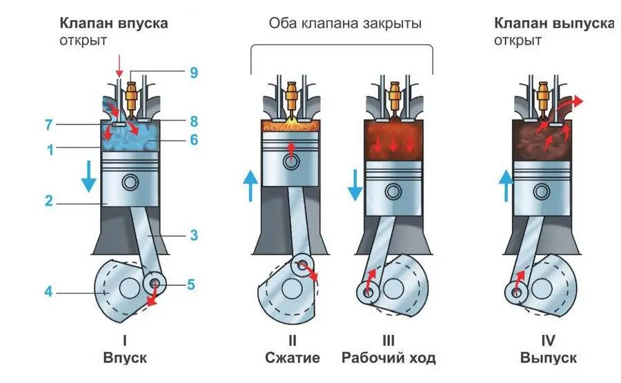

Паровая турбина - преобразует энергию водяного пара во вращение вала

В котле вода превращается в пар, пар под высоким давлением поступает на лопатки турбины и вращает вал.


$$η=\cfrac{A}{Q_{1}}$$


A - полезная работа
Q1 - теплота, полученная от нагревателя
Q2​ - теплота, переданная холодильнику

Либо


$$η=\frac{Q_{1}-Q_{2}}{Q_{1}}$$


Формула Карно:

$$η=\frac{T_{1}-T_{2}}{T_{2}}$$


$T_{1}$ - абсолютная температура нагревателя
$T_{2}$ - абсолютная температура холодильника
Обе в Кельвинах


---
---
---


<center><strong><h2>Электрические явления</h2></strong></center>

---

## 1
**Строение атома (на примере лития $Li^3_{7}$). Зарядовое и массовое числа. Электрический заряд. Элементарный электрический заряд. Электризация тел (примеры, объяснение). Закон сохранения электрического заряда**

Атом состоит из положительно заряженного ядра и отрицательно заряженных электронов

На примере атома $^3_{7}Li$:
- Зарядовое число $Z=3$
- Массовое число $A=7$
- 3 протона
- 4 нейтрона ($7-3=4$)

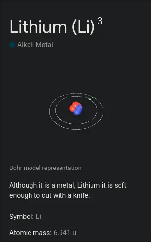

Электрический заряд - физическая величина, характеризующая способность тел участвовать в электромагнитных взаимодействиях

Элементарный электрический заряд - минимальный возможный эл. заряд $e=1,6\cdot 10^{-19} Кл$

Заряд электрона равен $-e$
Заряд протона равен $+e$

Электризация - процесс приобретения телом электрического заряда (шех и эбонитовая палочка, шарек, который потерли о волосы, шелк и стеклянная палочка)

Закон сохранения заряда - в замкнутой системе алгебраическая сумма зарядов неизменна

---

## 2
**Взаимодействие заряженных тел. Закон Кулона (формулировка, формула, рисунок, границы применимости)**

Заряженные тела взаимодействуют друг с другом посредством электрического поля

Одноимённые заряды отталкиваются, разноимённые заряды притягиваются

Закон Кулона - сила взаимодействия двух неподвижных точечных электрических зарядов в вакууме прямо пропорциональна произведению модулей этих зарядов и обратно пропорциональна квадрату расстояния между ними. Применим для точечных зарядов в вакууме

$$F=k\frac{|q_{1}q_{2}|}{r^{2}}$$

$$k=9\cdot 10^{9}\frac{Н\cdot м^2}{Кл^2}$$


```
← F            F →
(+) ---------- (+)
		r
```

```
F →            ← F
(+) ---------- (-)
		r
```


---

## 3
**Электрическое поле (определение, свойства). Силовые линии электрического поля (определение, рисунки). Напряжённость электрического поля (определение, формула). Однородное и неоднородное электрическое поле. Принцип суперпозиции электрических полей (определение, формула, рисунок)**

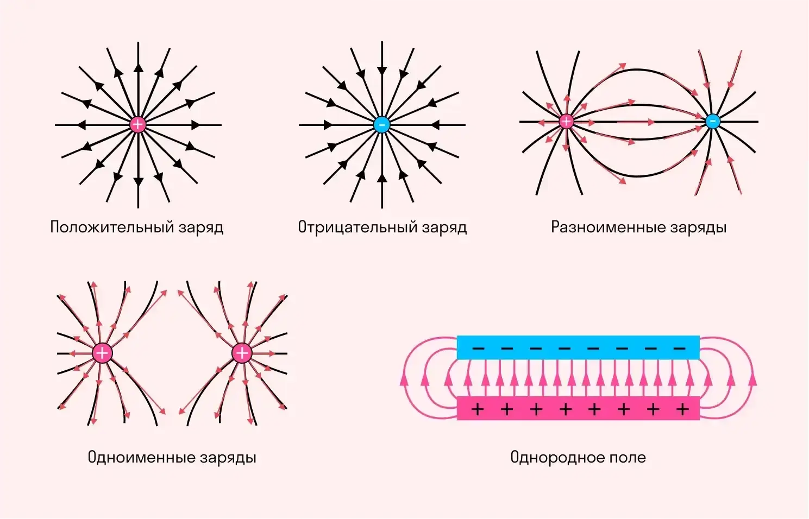

Электрическое поле - особый вид материи, существующий вокруг электрических зарядов и действующий на другие заряды

Свойства электрического поля
- Создаётся электрическими зарядами
- Действует на заряженные тела
- Обладает энергией
- Распространяется в пространстве

Силовые линии электрического поля - линии, касательные к которым показывают направление силы, действующей на положительный заряд (показаны на рисунке)

Напряжённость ($E$) - силовая характеристика электрического поля в каждой точке пространства. Вектор направлен от $+$ к $-$

$$E=\frac{F}{q},[E]=\left[ \frac{Н}{Кл} \right]$$

q - пробный заряд

Однородное поле - поле, в котором напряжённость одинакова по модулю и направлению во всех точках

Неоднородное поле - поле, в котором напряжённость изменяется от точки к точке

Принцип суперпозиции - напряженность результирующего поля равна векторной сумме напряженностей отдельных полей

$\vec{E}=\vec{E_{1}}+\vec{E_{2}}+\dots+\vec{E_{n}}$

---

## 4
**Конденсатор (определение, устройство, назначение). Виды конденсаторов. Электрическая ёмкость конденсатора (определение, формула). Формула для расчета энергии электростатического поля конденсатора. Соединение конденсаторов. Применение конденсаторов**

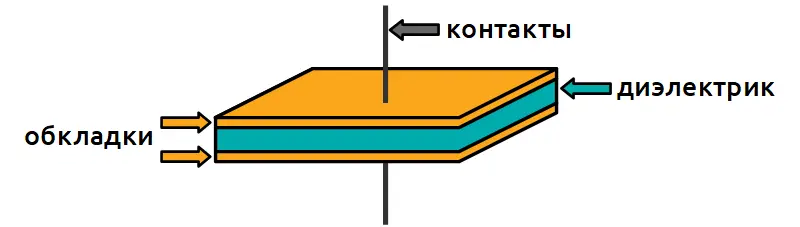

Конденсатор - устройство для накопления электрического заряда и энергии электрического поля

Назначение:
- Накопление заряда
- Накопление энергии электрического поля

Виды конденсаторов:
- плоские
- керамические
- электролитические
- плёночные
- переменной ёмкости

Электроёмкость($C$) показывает, какой заряд способен накопить конденсатор при данном напряжении

$$C=\frac{q}{U},[C]=[Ф] (Фарад)$$


q - заряд одной обкладки

1 Ф - это ёмкость такого конденсатора, который при напряжении 1 В накапливает заряд 1 Кл

Энергия заряженного конденсатора:

$$W=\frac{CU^2}{2}=\frac{qU}{2}=\frac{q^2}{2C}$$


Применение конденсаторов:
- Блоки питания
- Радиотехника
- Компьютеры
- Фотоаппараты
- Электродвигатели
- Системы накопления энергии

---

## 5
**Электрический ток (определение, условия возникновения). Источники тока (назначение, виды). Сила тока (определение, формула, единица измерения). Направление тока в электрической цепи. Амперметр и его включение в цепь**

Электрический ток - упорядоченное движение заряженных частиц

Условия возникновения:
- Свободные заряды
- Электрическое поле
- Замкнутая цепь

Источник тока - устройство, создающее и поддерживающее разность потенциалов (напряжение) на участках цепи

Виды источников тока
- Гальванические элементы (батарейки)
- Аккумуляторы
- Электрические генераторы
- Солнечные батареи

Сила тока ($I$) - физическая величина, показывающая, какой заряд проходит через поперечное сечение проводника за единицу времени


$$I=\frac{q}{t},[I]=[А]$$


1 $А$ - это сила тока, при которой через поперечное сечение проводника за 1 секунду проходит заряд 1 $Кл$

За направление тока условно принимают направление движения положительных зарядов(т.е. от плюса к минусу)

Амперметр - электроизмерительный прибор, предназначенный для измерения силы постоянного или переменного тока в электрической цепи. Включается последовательно

---

## 6
**Электрическое напряжение (определение, формула, единица измерения). Вольтметр, включение вольтметра в цепь**

Напряжение ($U$) - разность электрических потенциалов между двумя точками

$$U=I\cdot R,[U]=[В]$$

1 В — это такое напряжение, при котором поле совершает работу 1 Дж при перемещении заряда 1 Кл

Вольтметр - электроизмерительный прибор для измерения напряжения на участке цепи, включается параллельно этому участку

---

## 7
**Электрическое сопротивление и удельное сопротивление вещества (определение, формула, единица измерения). Реостат**

Сопротивление ($R$) - физическая величина, характеризующая способность проводника препятствовать прохождению электрического тока

$$R=\frac{U}{I}=\frac{ρl}{S},[R]=[Ом]$$


Удельное сопротивление ($ρ$)- сопротивление проводника длиной 1 $м$ и сечением 1 $м^2$ (это в СИ)

$$[ρ]=[Ом\cdot м] (В⠀СИ),[ρ]=\left[ \frac{Ом\cdot мм^2}{м} \right]$$


Реостат - прибор служащий для регулировки силы тока в электрической цепи путём плавного изменения сопротивления (меняет рабочую длину проводника)

---

## 8
**Закон Ома для участка цепи (формулировка, формула, границы применимости, ВАХ)**

~~Закон Ома - нету денег - сиди дома~~

Закон Ома - сила тока в проводнике прямо пропорциональна напряжению на его концах и обратно пропорциональна его электрическому сопротивлению

$$I=\frac{U}{R}$$


Применим при неизменности состояния проводника(температуры, структуры) и постоянном токе

ВАХ (вольт-амперная характеристика) — график зависимости силы тока от напряжения. 
Для омического проводника(проводник, для которого выполняется закон Ома):

```
I
↑
│   /
│  /
│ /
│/
/────────→ U
```


---

## 9
**Параллельное и последовательное соединение проводников**

Параллельное:

```
	|---(1)---|
⌀---|         |---⌀
	|---(2)---|
```

$$U=U_{1}=U_{2},I=I_{1}+I_{2},R=\frac{1}{R_{1}+R_{2}}$$


Последовательное:

```
⌀---(1)---(2)---⌀
```

$$U=U_{1}+U_{2},I=I_{1}=I_{2},R=R_{1}+R_{2}$$

---

## 10
**Работа и мощность электрического тока (формулы, единицы измерения). Закон Джоуля–Ленца (определение, формула), применение на практике**

Работа тока ($A$) - физическая величина, показывающая, какую работу совершают силы электрического поля по перемещению заряженных частиц внутри проводника

$$A=U\cdot I\cdot \tau,[A]=[Дж]$$


Мощность тока ($P$)- физическая величина, которая характеризует скорость передачи, потребления или превращения электрической энергии

$$P=\frac{A}{\tau}=U\cdot I,[P]=[Вт]$$


Закон Джоуля-Ленца - количество выделяемой теплоты прямо пропорционально квадрату силы тока, сопротивлению проводника и времени прохождения тока через проводник

$$Q=I^2R\tau$$

Применение закона Джоуля–Ленца
- Электрические чайники
- Утюги
- Обогреватели
- Электроплиты
- Плавкие предохранители
- Лампы накаливания


---
---
---


<center><strong><h2>Электромагнитные явления</h2></strong></center>

---

## 1
**Магниты и их свойства. Гипотеза Ампера. Магнитное поле постоянного магнита. Магнитное поле Земли**

Магнит - тело, создающее магнитное поле и способное притягивать некоторые вещества (железо, никель, кобальт и их сплавы)

Свойства магнитов
- имеют два полюса: северный (N) и южный (S)
- одноимённые полюса отталкиваются
- разноимённые полюса притягиваются
- магнитное действие наиболее сильно у полюсов

Согласно гипотезе Ампера, внутри молекул и атомов циркулируют элементарные электрические токи

Магнитное поле - особый вид материи, существующий вокруг магнитов и проводников с током и действующий на движущиеся заряды и магниты

Линии магнитного поля выходят из северного полюса и входят в южный

Земля обладает собственным магнитным полем и ведёт себя как огромный магнит

Магнитная стрелка компаса устанавливается вдоль линий магнитного поля Земли и показывает направление север-юг

---

## 2
**Магнитное поле и его свойства. Вектор магнитной индукции (определение, формула, единица измерения). Линии магнитной индукции (определение). Определение направления магнитных линий проводника с током и катушки с током**

Магнитное поле - особый вид материи, существующий вокруг магнитов и проводников с током и действующий на движущиеся заряды и магниты

Свойства магнитного поля
- создаётся магнитами и электрическими токами
- действует на движущиеся заряды и проводники с током
- обладает энергией
- обнаруживается по действию на магнитную стрелку

Магнитная индукция($\vec{B}$) - силовая характеристика магнитного поля

$$B=\frac{F_{Ампера}}{Il},[B]=[Тл](Тесла)$$


Линии магнитной индукции - линии, касательная к которым в каждой точке совпадает с направлением вектора магнитной индукции

Направление линий вокруг проводника с током:
- Если большой палец правой руки направить по току, то согнутые пальцы покажут направление магнитных линий

Катушка с током:
- Если обхватить катушку правой рукой так, чтобы пальцы были направлены по току в витках, то большой палец покажет направление северного полюса катушки

---

## 3
**Сила Ампера и сила Лоренца (определение, формула, единица измерения, поясняющие рисунки). Правило левой руки. Электродвигатель (схема, устройство, принцип работы)**

Сила Ампера - сила, с которой магнитное поле действует на проводник с током

$$F_{A}=BIl\sin α,[F_{A}]=[Н]$$


где
- $B$ - магнитная индукция
- $I$ - сила тока
- $l$ - длина проводника
- $α$ - угол между направлением тока и магнитного поля

Сила Лоренца - сила, действующая со стороны магнитного поля на движущийся электрический заряд

$$F_{Л}=qVB\sinα,[F_{Л}]=[Н]$$


Правило левой руки - если левую руку расположить так, чтобы линии магнитной индукции входили в ладонь, четыре пальца были направлены по току (или по движению положительного заряда), то отогнутый большой палец покажет направление силы Ампера (или силы Лоренца)

Электродвигатель - устройство, преобразующее электрическую энергию в механическую

Основные части:
- постоянный магнит или электромагнит
- рамка с током
- коллектор
- щётки
- вал

На рамку с током в магнитном поле действует сила Ампера. На разные стороны рамки силы направлены в противоположные стороны и создают вращающий момент. Коллектор меняет направление тока каждые пол-оборота, благодаря чему вращение продолжается непрерывно

[Как работает электродвигатель](https://ya.ru/video/preview/18233714328688158312?utm_source=copy_link&utm_medium=social&utm_campaign=share)

---

## 4
**Явление электромагнитной индукции (определение). Опыт Фарадея. Правило Ленца (определение, примеры). Генератор электроэнергии (схема, устройство, принцип работы)**

Электромагнитная индукция - явление возникновения электрического тока в замкнутом проводнике при изменении магнитного потока через этот проводник

Опыт Фарадея - Фарадей обнаружил, что ток возникает при изменении магнитного поля возле катушки. Если магнит неподвижен относительно катушки, ток не возникает

Правило Ленца - индукционный ток всегда имеет такое направление, что создаваемое им магнитное поле препятствует причине, вызвавшей этот ток

Примеры:
- при внесении магнита в катушку возникает ток, создающий поле, препятствующее приближению магнит
- при удалении магнита возникает ток, стремящийся удержать магнит

Генератор электроэнергии - устройство, преобразующее механическую энергию в электрическую

Основные части:
- магнитная система
- вращающаяся рамка (или катушка)
- контактные кольца
- щётки

Принцип работы - при вращении рамки в магнитном поле изменяется магнитный поток через неё. В результате возникает индукционный ток

```
Механическая энергия
          ↓
Вращение катушки
          ↓
Изменение магнитного потока
          ↓
Индукционный ток
          ↓
Электрическая энергия
```


---
---
---


<center><strong><h2>Световые явления</h2></strong></center>

---

## 1
**Свет и его свойства. Источники света (виды). Закон распространения света. Образование тени и полутени (рисунки). Лунные и солнечные затмения (рисунки)**

Свет - электромагнитное излучение, воспринимаемое человеческим глазом

Свойства света:
- распространяется с очень большой скоростью
- распространяется прямолинейно в однородной среде
- отражается
- преломляется
- переносит энергию

Источники света
По происхождению:
- Искусственные(лампа, светодиоид)
- Натуральные(Солнце)
По размерам:
- Точечный
- Протяженный

Закон распространения света - в однородной прозрачной среде свет распространяется прямолинейно

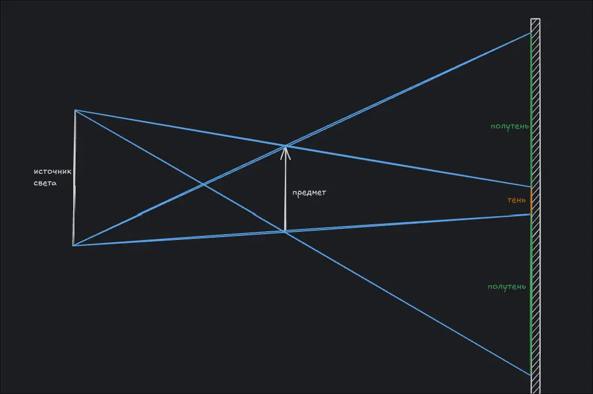

---

## 2
**Закон отражения света (определение, формула, рисунок). Построение изображения в плоском зеркале. Свойства изображения в плоском зеркале**

Отражение света - явление изменения направления распространения света на границе двух сред, при котором луч возвращается в первую среду

Закон отражения света
- Падающий луч, отражённый луч и перпендикуляр к поверхности в точке падения лежат в одной плоскости
- Угол падения равен углу отражения

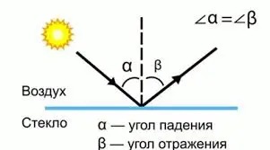

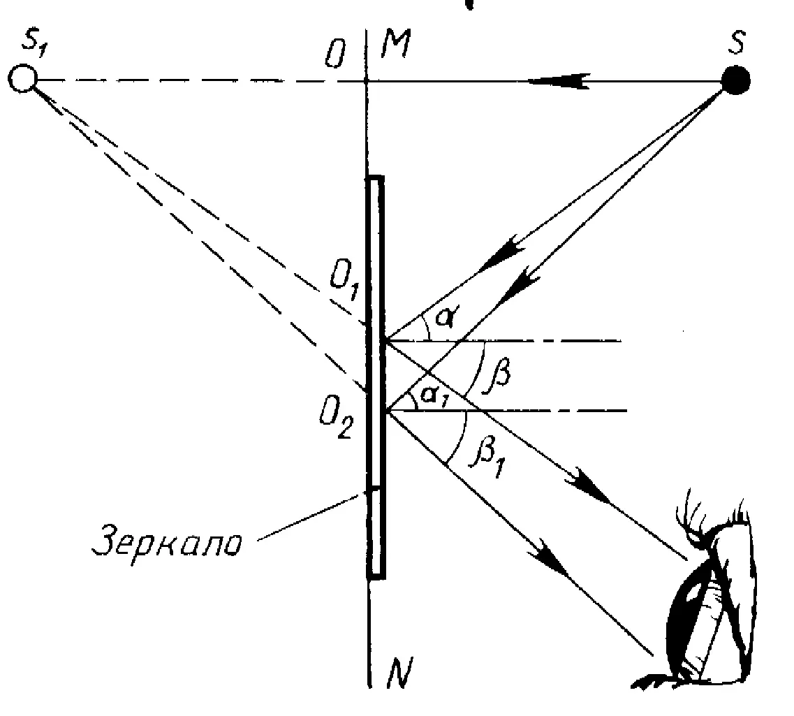

Изображение в плоском зеркале мнимое, прямое, равное по размеру предмету, на таком же расстоянии за зеркалом

---

## 3
**Явление преломления света. Абсолютный и относительный показатель преломления (определение, формула). Закон преломления света (определение, формула, рисунок). Построение хода лучей в плоскопараллельной пластине и в стеклянной призме**

Преломление света - изменение направления распространения света при переходе из одной среды в другую


Абсолютный показатель преломления

$$n=\frac{c}{v}​$$


где:

- $c$ — скорость света в вакууме
- $v$ — скорость света в веществе

Относительный показатель преломления

$$n_{21}=\frac{n_{2}}{n_{1}}$$


Закон преломления света - падающий луч, преломлённый луч и перпендикуляр к границе раздела лежат в одной плоскости

Для углов выполняется закон Снеллиуса:

$$n_{1}\sin⁡α=n_{2}\sin⁡β$$


где:
- n1, n2 - показатели преломления сред
- α - угол падения
- β - угол преломления

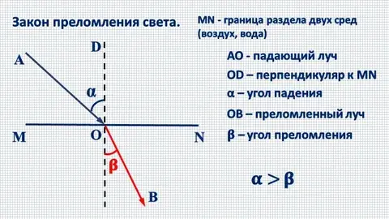

Плоскопараллельная пластина - луч дважды преломляется и выходит параллельно первоначальному направлению

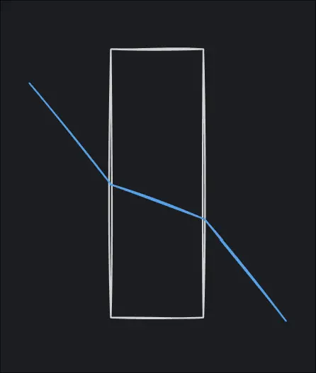

Стеклянная призма - луч дважды преломляется и отклоняется к основанию призмы

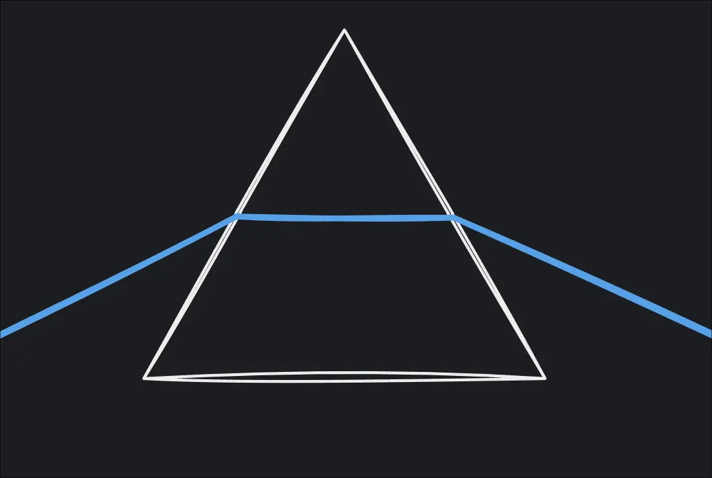

---

## 4
**Явление полного внутреннего отражения. Предельный угол полного внутреннего отражения (определение, формула, рисунок). Использование явления на практике**

Полное внутреннее отражение - возникает при переходе света из оптически более плотной среды в менее плотную (например, из стекла в воздух). Если угол падения превышает предельный угол, преломлённый луч исчезает, и свет полностью отражается обратно в первую среду

Предельный угол полного внутреннего отражения - угол падения, при котором угол преломления становится равным 90°

$$\sin \alpha_{пред}=\frac{n_{2}}{n_{1}},причем⠀n_{2}>n_{1}$$

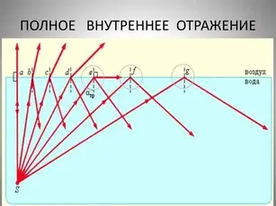

Применение:
- оптоволоконная связь
- медицинские эндоскопы
- световоды
- отражающие призмы в оптических приборах

---

## 5
**Линза. Виды линз. Построение изображения предмета в линзах и их свойства (рисунки)**

Линза - прозрачное тело, ограниченное двумя сферическими поверхностями или одной сферической и одной плоской поверхностью

Виды:
- Собирающая `()`. Изображение может быть любым
- Рассеивающая `)(`. Всегда дает мнимое прямое уменьшенное изображение

Построение:

В собирающей:
- Луч идет через оптический центр(не преломляется)
- Второй идет параллельно главной оси, после которой преломляется, идя к действительному фокусу
- Точка, которую мы строили, в точке их пересечения

В рассеивающей все то же самое, но через мнимый фокус

Построите сами

---

## 6
**Оптическая сила линзы и системы линз (определение, формула, единица измерения). Формула тонкой линзы (формула, рисунок). Увеличение, даваемое линзой. Недостатки зрения и их исправление**

Оптическая сила линзы($D$) - величина, обратная фокусному расстоянию

$$D=\frac{1}{F},[D]=[дптр](диоптрия)$$


Для системы линз эти значения складываются

Формула тонкой линзы:

$$\frac{1}{F}=\frac{1}{d}+\frac{1}{f}$$


где:
- F - фокусное расстояние линзы
- d - расстояние от предмета до линзы
- f - расстояние от изображения до линзы

Рисунок снова сами сделайте, пожалуйста

Увеличение линзы

$$Г=\frac{H}{h}=\frac{f}{d}$$


где:
- H — высота изображения
- h — высота предмета

Недостатки зрения

Близорукость - человек хорошо видит близкие предметы и плохо - удалённые. Исправляется рассеивающими линзами

Дальнозоркость - человек хорошо видит удалённые предметы и плохо - близкие. Исправляется собирающими линзами


---
---
---

<center><strong><h2>END OF BEGINNING...</h2></strong></center>
